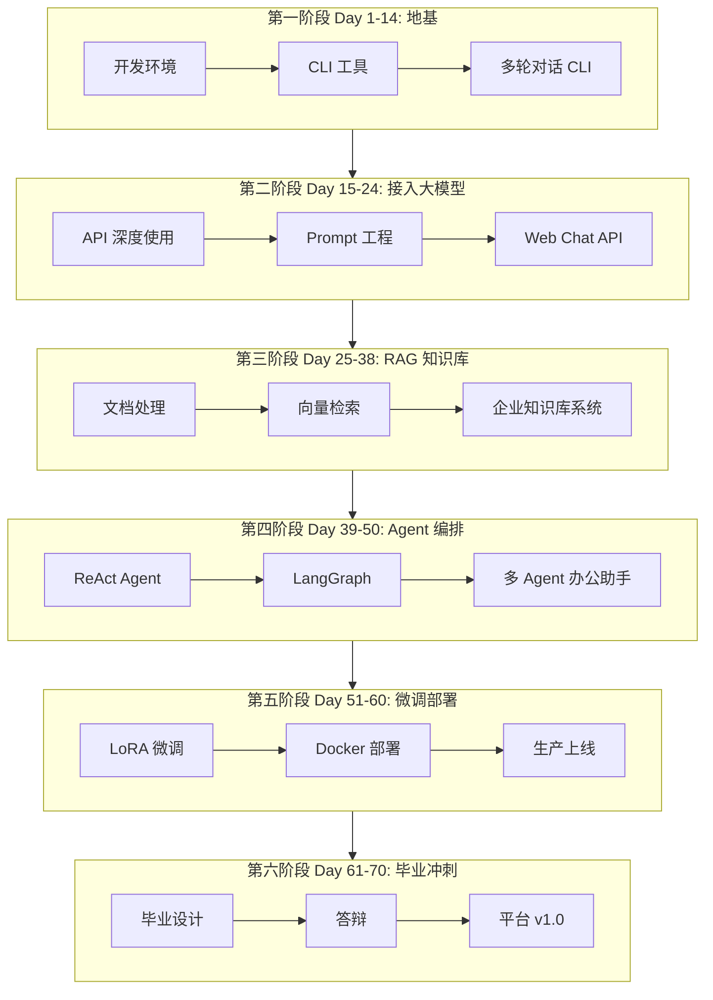

# NexusAgent 70天开发路线图

> 本文档是整个培训计划的「总施工图纸」。每一天的开发任务都服务于 NexusAgent 平台的迭代，请将此文档加入书签，随时查阅当前位置。

---

## 全景架构演进图

---

## 代码量增长规划

| 阶段 | 天数 | 累计代码行数（约） | 新增模块 |
|------|------|-------------------|----------|
| Python 基础 | 1-14 | 3,000 | `src/day01` ~ `src/day14` |
| 大模型 API | 15-24 | 8,000 | `src/llm/`, `src/api/` |
| RAG | 25-38 | 35,000 | `src/rag/`, `src/knowledge/` |
| Agent | 39-50 | 80,000 | `src/agent/`, `src/graph/` |
| 微调部署 | 51-60 | 120,000 | `src/finetune/`, `deploy/` |
| 毕业设计 | 61-70 | 200,000 | 全平台整合 |

---

## 逐日任务与平台交付物

### 第一阶段：Python 编程基础（Day 1-14）

| 天 | 学习主题 | 平台交付物 | 代码目录 |
|----|----------|------------|----------|
| **1** | 开发环境与第一行代码 | 项目仓库初始化、个人信息卡片 CLI | `src/day01/` |
| **2** | 运算符与字符串 | 文本清洗工具（文档预处理前置） | `src/day02/` |
| **3** | 流程控制 | 交互式菜单系统（平台 CLI 骨架） | `src/day03/` |
| **4** | 列表与集合 | 待办事项管理器 | `src/day04/` |
| **5** | 字典与 JSON | API 响应解析器 | `src/day05/` |
| **6** | 函数 | 工具函数库 `utils/` | `src/utils/` |
| **7** | 第一周复习 | 通讯录管理系统 + 周测 | `src/day07/` |
| **8** | 面向对象(上) | `ChatMessage` 类 | `src/models/message.py` |
| **9** | 面向对象(下) | `BaseModel` 抽象类体系 | `src/models/llm_base.py` |
| **10** | 模块与异常 | 多文件包结构重构 | 包结构重组 |
| **11** | 文件与标准库 | 文档批量读取工具 | `src/tools/doc_reader.py` |
| **12** | 网络与 API | 首次 LLM API 调用 | `src/llm/client.py` |
| **13** | 装饰器与异步 | API 重试与超时机制 | `src/llm/retry.py` |
| **14** | **阶段项目一** | 命令行多轮对话 AI 助手 | `src/chat/cli_assistant.py` |

### 第二阶段：大模型基础与 Prompt 工程（Day 15-24）

| 天 | 学习主题 | 平台交付物 |
|----|----------|------------|
| 15 | 大模型原理科普 | Token 计算器 `src/llm/token_counter.py` |
| 16 | API 参数详解 | 流式输出模块 `src/llm/streaming.py` |
| 17 | Prompt 基础 | Prompt 模板库 `src/prompts/` |
| 18 | Prompt 进阶 | 意图分类器 |
| 19 | Function Calling | 工具调用引擎雏形 |
| 20 | 多模态与 Embedding | 相似问题匹配服务 |
| 21 | 周测 | 多轮对话+工具调用整合 |
| 22 | 前端速成 | 静态聊天页面 `frontend/` |
| 23 | FastAPI(上) | Chat REST API `src/api/chat.py` |
| 24 | FastAPI(下) | **网页版 ChatGPT 克隆** |

### 第三阶段：LangChain 与 RAG（Day 25-38）

| 天 | 学习主题 | 平台交付物 |
|----|----------|------------|
| 25 | LangChain 入门 | LangChain 版对话模块 |
| 26 | LCEL 与链 | 翻译-润色-摘要链 |
| 27 | Memory | 多会话记忆管理 |
| 28 | 文档加载分割 | 文档处理流水线 |
| 29 | 向量数据库 | Chroma 知识库接入 |
| 30 | 完整 RAG | 命令行知识库问答 |
| 31 | RAG 调优 | 检索参数实验报告 |
| 32 | 高级 RAG(上) | Query Rewriting |
| 33 | 高级 RAG(下) | 混合检索 + Rerank |
| 34 | RAG 评估 | Ragas 评估报告 |
| 35 | LlamaIndex | 框架对比与选型 |
| 36-37 | **阶段项目二** | **企业级知识库问答系统** |
| 38 | 项目答辩 | 代码评审与重构 |

### 第四阶段：Agent 开发（Day 39-50）

| 天 | 学习主题 | 平台交付物 |
|----|----------|------------|
| 39 | ReAct 范式 | 手写 ReAct Agent |
| 40 | LangChain Agent | 工具注册与执行 |
| 41 | LangGraph 入门 | 状态机编排引擎 |
| 42 | LangGraph 进阶 | 人工审批工作流 |
| 43 | 多 Agent | Supervisor 模式 |
| 44 | MCP 协议 | 自研 MCP Server |
| 45 | 周测 + Dify | 低代码平台对比 |
| 46 | Agent 工程化 | 可观测性与容错 |
| 47 | 实用场景 | Text-to-SQL Agent |
| 48-49 | **阶段项目三** | **多 Agent 智能办公助手** |
| 50 | 项目答辩 | 阶段复盘 |

### 第五阶段：微调与部署（Day 51-60）

| 天 | 学习主题 | 平台交付物 |
|----|----------|------------|
| 51 | 微调理论 | 技术选型决策树 |
| 52 | 数据集构建 | 客服领域微调数据集 |
| 53 | LLaMA-Factory | Qwen2.5-7B LoRA 微调 |
| 54 | 评估与合并 | 模型量化导出 |
| 55 | 本地部署 | vLLM 推理服务 |
| 56 | Docker 部署 | 容器化编排 |
| 57 | 周测 + 安全 | 内容审核与合规 |

### 第六阶段：毕业设计（Day 58-70）

| 天 | 主题 |
|----|------|
| 58 | 毕业设计启动 |
| 59-64 | 毕业设计开发（6天） |
| 65 | 毕业答辩 |
| 66 | 简历与作品集 |
| 67-69 | 面试冲刺 |
| 70 | 结业 |

---

## Sprint 规划（前 4 个 Sprint）

### Sprint 0（Day 1）：项目启动

- **目标**：所有人完成开发环境配置，跑通第一个 Python 程序
- **交付**：`nexus-agent-platform` 仓库初始化，Day 1 代码合并到 `develop`

### Sprint 1（Day 2-7）：CLI 工具链

- **目标**：掌握 Python 基础语法，完成 CLI 工具集
- **交付**：通讯录管理系统

### Sprint 2（Day 8-14）：对话能力

- **目标**：面向对象 + 首次 API 调用 + 多轮对话
- **交付**：阶段项目一

### Sprint 3（Day 15-21）：Prompt 与工具

- **目标**：Prompt 工程 + Function Calling
- **交付**：意图分类器 + 工具调用助手

---

*路线图随项目迭代持续更新，当前版本：v0.1.0（Day 1）*
