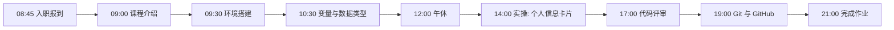

# Day 1 旁白解读：一切从这里开始

> **阅读时间**：约 15 分钟  
> **阅读建议**：在学习任何技术内容之前，请先完整读完本篇。它会告诉你「今天写的每一行代码，最终都会流向哪里」。

---

## 旁白

2026 年 7 月 6 日，星期一，上午 8 点 45 分。

智链科技上海总部，17 楼开放办公区。中央空调送出带着咖啡味的凉风，落地窗外是陆家嘴的天际线。你刷卡通过闸机，在前台领取了工牌、一台 MacBook Pro 和一张写着「欢迎加入智链科技」的卡片。

人力资源部的姐姐带你来到 17-B 区，一块白板上写着：

```
NexusAgent 项目组 · Sprint 0 启动日
目标：全员环境就绪，跑通第一行代码
```

你的直属导师赵岩（后端 Tech Lead）走过来，递给你一份打印好的文档——就是你现在看到的这份 Day 1 课件。他说：

> 「别紧张。70 天前，我也是从零开始的。今天你不会写任何『高大上』的 AI 代码，但你会做一件更重要的事——**成为这个平台的第一个贡献者**。今天结束时，你的代码会出现在 `nexus-agent-platform` 仓库的 `develop` 分支上。这意味着，从现在起，你不再是一个『学生』，你是智链科技的工程师。」

---

## 今天的你在整个故事中的位置

如果把 NexusAgent 平台的 70 天建设看作一部连续剧，那么：

| 时间线 | 剧情 | 你的角色 |
|--------|------|----------|
| **今天（Day 1）** | 入职、配环境、写第一行 Python | 新入职初级工程师 |
| Day 7 | 第一个可演示的 CLI 工具 | 能独立完成功能模块的开发者 |
| Day 14 | 第一个能对话的 AI 助手 | 能调用 API 的 AI 应用开发者 |
| Day 24 | 网页版聊天界面 | 全栈 AI 应用开发者 |
| Day 38 | 企业知识库系统 | RAG 系统开发者 |
| Day 50 | 多 Agent 办公助手 | Agent 架构师（初级） |
| Day 65 | 平台 v1.0 发布 | 高级 AI 应用开发工程师 |

**今天看起来最简单的东西——一个打印个人信息的 Python 程序——并不是『练习题』。**

在 NexusAgent 平台的真实需求文档（编号 ZL-NA-REQ-001）里，有一项功能叫「**开发者入职信息采集**」：当新成员加入某个租户（企业客户）的工作空间时，系统需要收集并格式化展示其基本信息。Day 1 的「个人信息卡片」程序，正是这个功能的**最原始原型**。

三个月后，当平台的管理控制台上线时，这段逻辑会演变成一个 REST API：

```
POST /api/v1/tenants/{tenant_id}/members
```

请求体：

```json
{
  "name": "张三",
  "email": "zhangsan@example.com",
  "role": "developer",
  "department": "AI 平台组"
}
```

响应体：

```json
{
  "id": "mem_8f3a2b1c",
  "display_card": "┌─────────────────────────┐\n│  智链科技 · 员工信息卡   │\n│  姓名: 张三              │\n│  ...                     │\n└─────────────────────────┘",
  "created_at": "2026-10-06T09:00:00Z"
}
```

看到了吗？**`display_card` 字段的格式化逻辑，就是你今天要用 Python 字符串拼接实现的东西。**

---

## 为什么从 Python 开始，而不是直接调 ChatGPT API？

这是上周架构评审会上，实习生小李问过的问题。陈默总监的回答值得铭记：

> 「大模型应用开发，本质上仍然是**软件工程**。Python 是这个领域事实上的标准语言——LangChain 用它，LlamaIndex 用它，FastAPI 用它，PyTorch 也用它。你可以不会算法，可以不会深度学习，但你必须能用 Python 把业务逻辑写清楚。
>
> 更重要的是，**API 返回的全是 JSON，文档处理靠的是字符串，Prompt 模板本质是 f-string**。Python 基础不牢，后面全是空中楼阁。」

---

## 今日学习路径（建议时间分配）



---

## 今日结束后，你应该能够——

1. 在本机运行 `python3 --version` 看到 3.10 或更高版本
2. 用 VS Code 打开 `nexus-agent-platform` 项目并运行 `personal_info_card.py`
3. 解释什么是变量、int/float/str/bool 四种基本类型
4. 使用 `print()` 和 `input()` 完成一个交互式程序
5. 完成第一次 Git commit 并 push 到远程仓库
6. 在团队 Slack（模拟）频道发送消息：「Day 1 任务完成 ✅」

---

## 给「完全零基础」同学的一段话

如果你从未写过任何代码，今天可能会感到信息过载。这完全正常。

请记住三个原则：

1. **不要试图一次记住所有东西**。今天只需要记住：`print` 是输出，`input` 是输入，变量就是「贴了标签的盒子」。
2. **敲代码时允许犯错**。报错信息是朋友，不是敌人。把报错信息复制给导师或搜索引擎，90% 的问题都能解决。
3. **每天进步一点点**。70 天后回头看 Day 1，你会觉得简单到不可思议——这正是成长的标志。

---

## 上下文索引（后续天数关联）

| 今天学的 | 后续用在 |
|----------|----------|
| `print` / f-string | Day 2 字符串格式化、Day 17 Prompt 模板 |
| `input` | Day 3 菜单系统、Day 14 对话助手 |
| 变量与类型 | Day 5 JSON 解析、Day 12 API 调用 |
| Git 提交 | 全程：每天代码都需要 commit |
| 个人信息卡片 | Day 8 重构为 `ChatMessage` 类、Day 23 封装为 API |

---

*下一篇：[01_企业背景与今日任务.md](01_企业背景与今日任务.md)*
