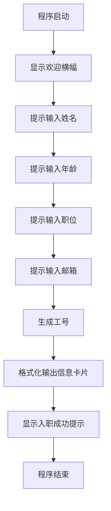

# ZL-NA-REQ-001：开发者入职信息采集模块

**文档类型**：产品需求文档（PRD 节选）  
**版本**：v0.1.0  
**作者**：林薇  
**评审人**：陈默、赵岩  
**状态**：已批准  
**关联 Sprint**：Sprint 0 / Day 1

---

## 1. 需求概述

### 1.1 背景

NexusAgent 平台采用多租户架构。每个企业客户（租户）拥有独立的工作空间（Workspace），工作空间内的成员（Member）需要完成注册后才能使用平台功能。

在平台管理控制台上线之前（预计 Day 24+），我们需要一个**命令行版本**的成员信息采集工具，供内部开发和测试使用。

### 1.2 目标

实现一个命令行程序，采集开发者基本信息并以格式化卡片形式输出，作为后续「成员注册 API」的功能原型。

### 1.3 非目标（本期不做）

- 数据持久化（Day 5 学 JSON 后添加）
- 网络请求与 API 封装（Day 12 添加）
- 输入校验的完整边界处理（Day 6 学函数后重构）
- Web 界面（Day 22-24 添加）

---

## 2. 用户故事

```
作为一个 新加入 NexusAgent 项目的开发者，
我希望 在命令行中输入我的基本信息并看到格式化的员工卡片，
以便 确认我的信息已被正确采集，并体验平台的入职流程。
```

**验收标准**：

1. 程序启动后显示欢迎语，说明这是 NexusAgent 开发者入职信息采集
2. 依次提示输入：姓名、年龄、职位、邮箱（共 4 项）
3. 输入完成后，输出格式化的信息卡片
4. 卡片包含公司 Logo 区域（ASCII 字符画）、输入的所有字段、生成时间
5. 程序正常结束，不崩溃

---

## 3. 功能需求

### 3.1 输入规格

| 字段 | 类型 | 必填 | 说明 | 示例 |
|------|------|------|------|------|
| name | string | 是 | 员工姓名，1-20 字符 | 张三 |
| age | int | 是 | 年龄，18-65 | 25 |
| role | string | 是 | 职位名称 | 后端开发工程师 |
| email | string | 是 | 电子邮箱 | zhangsan@zhilian.tech |

### 3.2 输出规格

输出为控制台文本，格式如下（边框字符可使用 `┌─┐│└─┘` 或 `+-+|`）：

```
╔══════════════════════════════════════╗
║     智链科技 · NexusAgent 项目组      ║
║         开发者入职信息卡 v0.1          ║
╠══════════════════════════════════════╣
║  姓名：张三                            ║
║  年龄：25                              ║
║  职位：后端开发工程师                   ║
║  邮箱：zhangsan@zhilian.tech           ║
╠══════════════════════════════════════╣
║  工号：ZL-20260706-001（自动生成）      ║
║  入职日期：2026-07-06                  ║
╚══════════════════════════════════════╝
```

### 3.3 工号生成规则（简化版）

格式：`ZL-{YYYYMMDD}-{序号}`

- `ZL`：智链科技前缀（固定）
- `YYYYMMDD`：当天日期
- `序号`：3 位数字，Day 1 简化实现为固定 `001`（Day 3 学循环后实现自增）

---

## 4. 技术约束

| 约束 | 说明 |
|------|------|
| 语言 | Python 3.11 |
| 依赖 | 仅标准库（不引入第三方包） |
| 文件位置 | `nexus-agent-platform/src/day01/personal_info_card.py` |
| 编码 | UTF-8 |
| 运行方式 | `python src/day01/personal_info_card.py` |

---

## 5. 界面流程



---

## 6. 异常场景（Day 1 简化处理）

| 场景 | Day 1 处理 | 后续优化日 |
|------|------------|------------|
| 年龄输入非数字 | 程序崩溃（接受） | Day 6 加 try/except |
| 空姓名 | 允许空（接受） | Day 3 加 if 判断 |
| 邮箱格式错误 | 不校验（接受） | Day 11 用正则校验 |

---

## 7. 测试用例

| 用例 ID | 输入 | 期望输出 |
|---------|------|----------|
| TC-001 | 姓名=李四, 年龄=28, 职位=产品经理, 邮箱=lisi@zhilian.tech | 卡片包含所有字段，工号含当天日期 |
| TC-002 | 姓名=王五, 年龄=22, 职位=实习生, 邮箱=wangwu@test.com | 正常输出，无报错 |
| TC-003 | 姓名含中文较长（如「欧阳修」） | 边框不错位（Day 1 可暂不处理对齐） |

---

## 8. 后续演进路线

```
Day 1  → CLI 信息采集（本文档）
Day 5  → 增加 JSON 文件持久化
Day 8  → 重构为 Member 类
Day 12 → 增加 API 提交到远程服务
Day 23 → 封装为 FastAPI POST /api/v1/members
Day 56 → Docker 容器化部署
```

---

*评审签字：林薇 ✅ 陈默 ✅ 赵岩 ✅*
