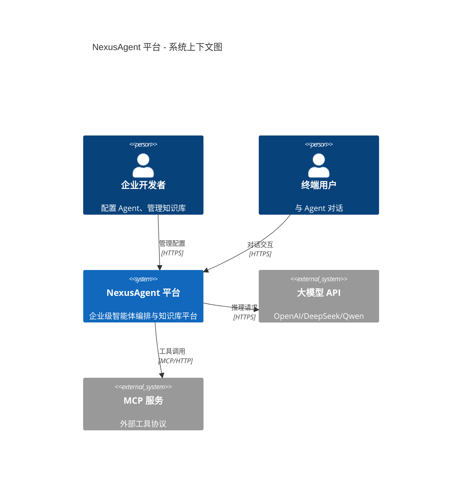
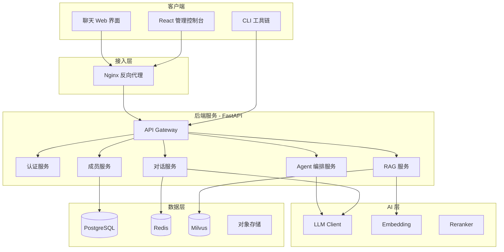
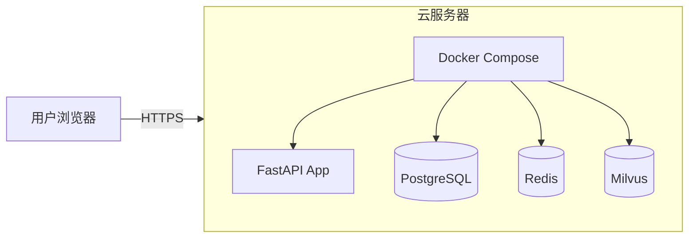

# Day 1 架构设计：NexusAgent 平台全局视图（v0.1）

**文档编号**：ZL-NA-ARCH-001  
**版本**：v0.1.0  
**作者**：陈默  
**状态**：初稿（随项目逐日演进）

---

## 1. 架构设计说明

今天是 Day 1，平台尚未编写任何业务代码。本文档展示的是**目标架构的全景图**，帮助你建立「每天写的代码最终去向」的全局认知。

当前阶段（Day 1）只需关注图中 **红色高亮** 的模块。

---

## 2. 系统上下文图（C4 Level 1）



---

## 3. 容器图（C4 Level 2）— 目标态



---

## 4. Day 1 涉及模块

今天只建设最底层的 **CLI 工具链** 中的第一个程序：

```
nexus-agent-platform/
└── src/
    └── day01/
        ├── __init__.py
        ├── personal_info_card.py    ← 今日核心交付
        └── constants.py             ← 公司常量（名称、版本）
```

**对应目标架构中的模块**：`MEMBER_SVC`（成员服务）的 CLI 原型

---

## 5. 技术选型决策记录

| 决策项 | 选型 | 理由 | 决策日 |
|--------|------|------|--------|
| 后端语言 | Python 3.11 | AI 生态最成熟 | Day 0（立项） |
| Web 框架 | FastAPI | 异步、自动文档、类型提示 | Day 23 引入 |
| Agent 框架 | LangGraph | 状态机编排、可持久化 | Day 41 引入 |
| 向量数据库 | Milvus | 开源、高性能、企业级 | Day 29 引入 |
| 关系数据库 | PostgreSQL | 稳定、JSON 支持好 | Day 24 引入 |
| 缓存 | Redis | 会话管理、任务队列 | Day 27 引入 |
| 容器化 | Docker Compose | MVP 阶段足够 | Day 56 引入 |

---

## 6. 代码仓库结构（Day 1 初始态）

```
nexus-agent-platform/
├── README.md                 # 项目说明
├── requirements-day01.txt    # Day 1 依赖（空/最小）
├── .gitignore
├── .env.example              # 环境变量模板（Day 12 使用）
├── src/
│   ├── __init__.py
│   └── day01/                # 按天组织，后期重构为模块
│       ├── __init__.py
│       ├── constants.py
│       └── personal_info_card.py
├── tests/
│   └── day01/
│       └── test_personal_info_card.py
└── docs/
    └── ARCHITECTURE.md         # 架构文档（本文档副本）
```

### 为什么按 `dayXX` 组织，而不是直接按模块？

赵岩在架构评审时的解释：

> 「培训期间，学员需要清晰看到每一天的交付物。如果 Day 1 就直接建 `src/member/`，学员会困惑『我还没学面向对象，为什么要建包？』。
>
> Day 10 学模块与包之后，我们会做一次**重构 Sprint**，把 `day01`~`day14` 的代码迁移到正式模块结构中。这也是真实项目中常见的『先跑通再重构』策略。」

**迁移计划**（预告）：

| 原路径 | 目标路径 | 迁移日 |
|--------|----------|--------|
| `src/day01/personal_info_card.py` | `src/member/cli/collector.py` | Day 10 |
| `src/day08/chat_message.py` | `src/models/message.py` | Day 10 |
| `src/day12/llm_client.py` | `src/llm/client.py` | Day 13 |

---

## 7. 数据模型预览（Day 8 实现，今日了解即可）

```python
# 今日采集的数据，未来会对应这个模型：
class Member:
    id: str              # 工号，如 ZL-20260706-001
    name: str            # 姓名
    age: int             # 年龄
    role: str            # 职位
    email: str           # 邮箱
    tenant_id: str       # 租户 ID（Day 24 添加）
    workspace_id: str    # 工作空间 ID
    created_at: datetime # 创建时间
```

---

## 8. 安全架构原则（从 Day 1 养成习惯）

1. **不在代码中硬编码密码和 API Key**（Day 13 学 dotenv）
2. **敏感信息不 print 到日志**（邮箱可显示，密码绝不可）
3. **所有外部输入视为不可信**（Day 3 学 if 校验，Day 11 学正则）
4. **最小权限原则**（开发环境不用生产数据库）

---

## 9. 部署架构预览（Day 56 实现）



---

*本文档随项目迭代持续更新。Day 1 版本仅包含 CLI 层设计。*
