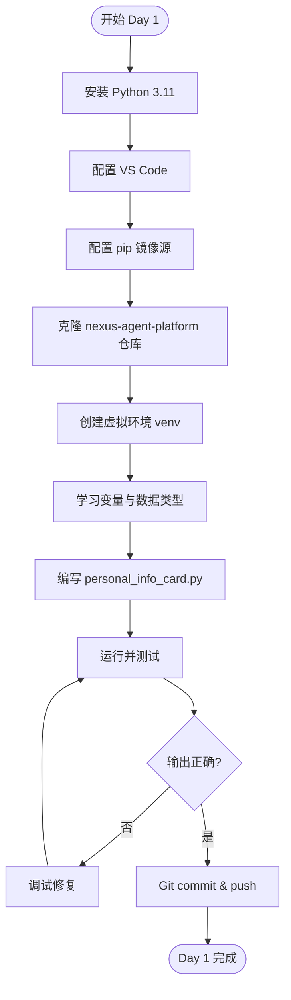
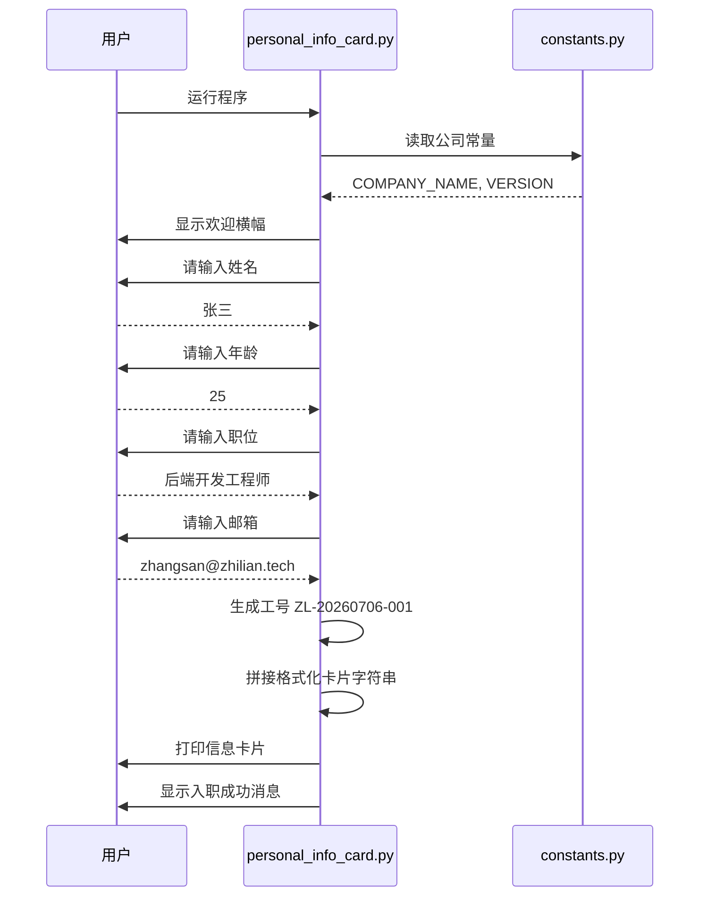
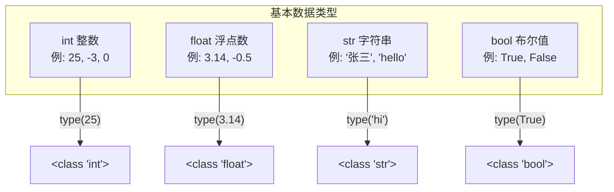
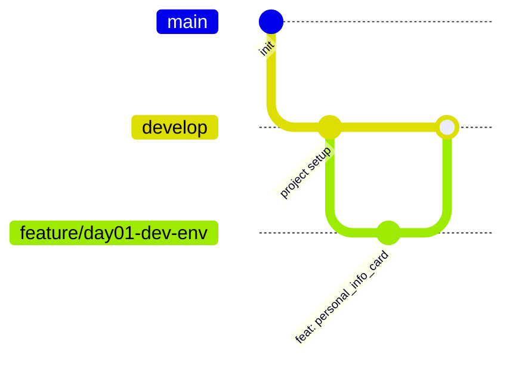

# Day 1 流程图与示意图

---

## 1. 今日开发流程



---

## 2. 程序执行流程（个人信息卡片）



---

## 3. Python 程序基本结构示意图

```
┌─────────────────────────────────────────────┐
│              Python 源文件 (.py)              │
├─────────────────────────────────────────────┤
│  ① 模块文档字符串 (docstring)                 │
│     说明这个文件是干什么的                      │
├─────────────────────────────────────────────┤
│  ② 导入语句 (import)                          │
│     引入需要使用的模块                          │
├─────────────────────────────────────────────┤
│  ③ 常量定义                                   │
│     不会变化的值，如公司名称                     │
├─────────────────────────────────────────────┤
│  ④ 函数定义 (def)          ← Day 6 重点学     │
│     可复用的代码块                              │
├─────────────────────────────────────────────┤
│  ⑤ 主程序入口 (if __name__ == "__main__")    │
│     程序从这里开始执行                          │
└─────────────────────────────────────────────┘
```

---

## 4. 变量与内存示意图

当你执行 `name = "张三"` 时，计算机内存中发生：

```
  变量名 (标签)          内存地址              值
  ┌──────────┐         ┌──────────┐
  │   name   │ ──────> │ 0x7f8a3c │ ──> "张三"
  └──────────┘         └──────────┘
  
  当你执行 name = "李四" 时：
  
  ┌──────────┐         ┌──────────┐
  │   name   │ ──────> │ 0x7f8b4d │ ──> "李四"  (原 "张三" 被替换)
  └──────────┘         └──────────┘
```

**关键理解**：变量名是「标签」，不是「盒子」。标签可以撕下来贴到别的值上。

---

## 5. 四种基本数据类型关系图



---

## 6. Git 工作流（今日首次使用）



---

## 7. 开发环境架构图

```
┌──────────────── 你的笔记本电脑 ────────────────┐
│                                               │
│  ┌─────────────┐    ┌─────────────────────┐  │
│  │   VS Code   │───>│  Python 3.11 解释器  │  │
│  │  (编辑器)    │    │  (运行代码)          │  │
│  └─────────────┘    └─────────────────────┘  │
│         │                      │              │
│         v                      v              │
│  ┌─────────────┐    ┌─────────────────────┐  │
│  │    Git      │───>│  GitHub 远程仓库     │  │
│  │  (版本控制)  │    │  nexus-agent-platform│  │
│  └─────────────┘    └─────────────────────┘  │
│                                               │
└───────────────────────────────────────────────┘
```

---

## 8. 今日代码在平台中的位置（鸟瞰图）

```
                    NexusAgent 平台
    ┌─────────────────────────────────────────┐
    │                                         │
    │   [Web 控制台]  [聊天界面]  [API 网关]   │  ← Day 22+ 建设
    │                                         │
    │   [对话服务]  [RAG 服务]  [Agent 服务]   │  ← Day 15+ 建设
    │                                         │
    │   ┌─────────────────────────────────┐   │
    │   │  ★ [CLI 成员信息采集] ← 你今天  │   │  ← Day 1 建设
    │   └─────────────────────────────────┘   │
    │                                         │
    └─────────────────────────────────────────┘
```

---

*配合 [05_课堂笔记_上午.md](05_课堂笔记_上午.md) 和 [06_课堂笔记_下午.md](06_课堂笔记_下午.md) 阅读*
