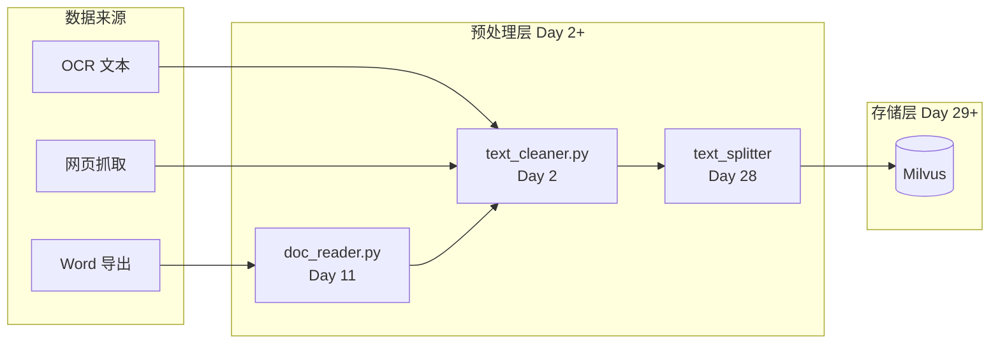
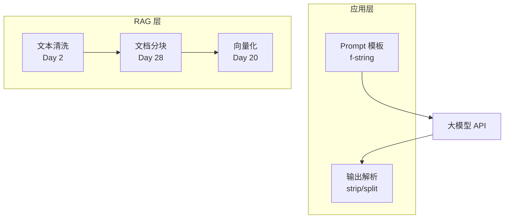

# Day 2 架构设计：文档预处理流水线（v0.2）

**文档编号**：ZL-NA-ARCH-002  
**版本**：v0.2.0  
**作者**：周航 / 陈默  
**状态**：已更新（新增预处理层）

---

## 1. 今日架构变更

在 Day 1 的 CLI 工具链基础上，新增 **文档预处理层（Preprocessor）**：



---

## 2. Day 2 模块设计

```
nexus-agent-platform/src/day02/
├── __init__.py
├── constants.py          # 敏感词表、清洗配置
├── text_cleaner.py       # CLI 入口 + 清洗逻辑
├── sample_docs/          # 测试用脏数据
│   ├── raw_notice.txt
│   ├── raw_faq.txt
│   └── raw_policy.txt
└── exercises/            # 课后练习
```

### 2.1 模块职责

| 模块 | 职责 | 对外接口 |
|------|------|----------|
| `constants.py` | 敏感词、默认配置 | 常量 |
| `text_cleaner.py` | 清洗逻辑 + CLI | `clean_text()`, `main()` |

### 2.2 清洗管道（Pipeline）设计

```python
# 概念模型（Day 6 会重构为独立函数）
raw_text
  → normalize_lines()      # 逐行 trim
  → collapse_whitespace()  # 合并空白
  → collapse_punctuation() # 合并重复标点
  → mask_sensitive_words() # 敏感词打码
  → optional_lower()       # 可选小写
  → drop_empty_lines()     # 删除空行
  → cleaned_text
```

**设计原则**：每个步骤单一职责，可单独开关（Day 3 菜单、Day 6 函数化）。

---

## 3. 与 Day 1 架构的关系

```
src/
├── day01/                    # 成员信息采集
│   └── personal_info_card.py
└── day02/                    # 文档文本清洗 ← 今日新增
    └── text_cleaner.py
```

Day 10 重构后的目标路径：

```
src/
├── member/                   # 来自 day01
├── preprocessing/            # 来自 day02/day11
│   ├── cleaner.py
│   └── reader.py
└── ...
```

---

## 4. 字符串处理在大模型栈中的位置



---

## 5. 性能与质量考量（企业级思维）

| 维度 | Day 2 策略 | 后续优化 |
|------|------------|----------|
| 大文件 | 整文件读入内存 | Day 11 流式处理 |
| 敏感词 | 简单 replace 循环 | Day 11 Aho-Corasick |
| 手机号 | 样本级简单处理 | Day 11 `re.sub` |
| 编码 | 强制 UTF-8 | Day 11 chardet 检测 |

---

*下一篇：[04_流程图与示意图.md](04_流程图与示意图.md)*
