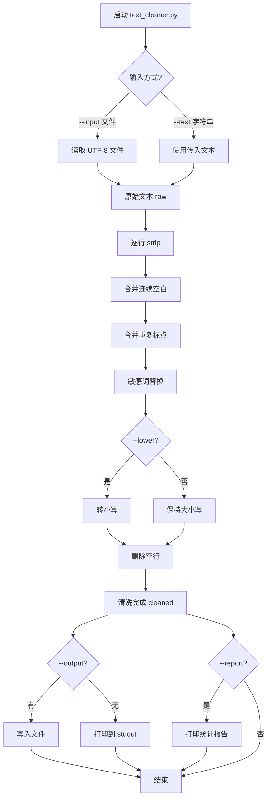

# Day 2 流程图与示意图

---

## 1. 文本清洗主流程



---

## 2. 字符串切片示意图

```
字符串:  "NexusAgent"
索引:     0 1 2 3 4 5 6 7 8 9
         N e x u s A g e n t
        -10...............-1  (负索引)

s[0]   → 'N'
s[-1]  → 't'
s[0:5] → 'Nexus'    (不含索引 5)
s[5:]  → 'Agent'
s[::-1]→ 'tnegAtexeN' (反转)
```

---

## 3. 运算符优先级记忆图

```
高 ────────────────────────────────────── 低

  ( )          括号
  **           幂运算
  * / // %     乘除
  + -          加减
  < <= > >=    比较
  == !=        相等
  not          逻辑非
  and          逻辑与
  or           逻辑或

记忆口诀：括幂乘，加减比，相等逻辑排最后
```

---

## 4. f-string 格式化速查

```
语法:  f"{表达式:格式说明符}"

{name}           直接插入
{age:05d}        整数，宽度5，不足补0  → 00025
{pi:.2f}         浮点，保留2位小数    → 3.14
{ratio:.1%}      百分比               → 14.2%
{text:<20}       左对齐，宽度20
{text:>20}       右对齐
{text:^20}       居中
```

---

## 5. 清洗前后对比示意

```
┌─── 清洗前 (raw) ───────────────────────────┐
│                                            │
│    智链科技   理财产品说明                    │
│                                            │
│  年化收益率可达8！！！请联系客服              │
│  【内部资料】禁止外传                         │
│  电话：13812345678                          │
│                                            │
└────────────────────────────────────────────┘
                    │
                    ▼ text_cleaner.py
┌─── 清洗后 (cleaned) ───────────────────────┐
│                                            │
│ 智链科技 理财产品说明                         │
│ 年化收益率可达8!请联系客服                    │
│ 【***】***                                  │
│ 电话：13812345678                           │
│                                            │
└────────────────────────────────────────────┘
```

---

*配合课堂笔记阅读*
