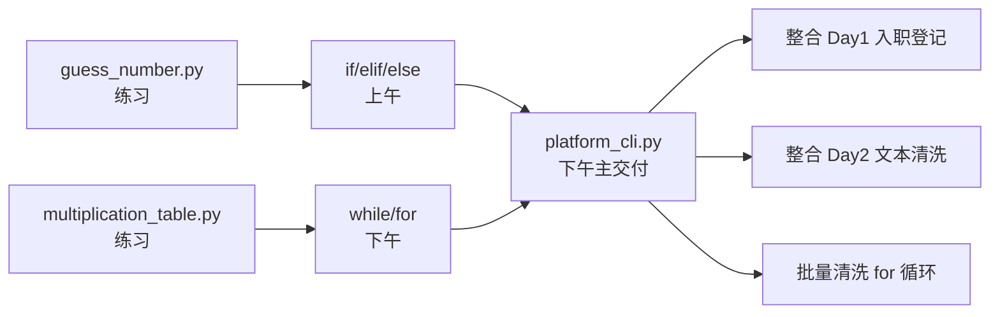

# Day 3 旁白解读：让程序会「做决定」

> **阅读时间**：约 15 分钟  
> **前置要求**：完成 Day 1-2，`text_cleaner.py` 能正常运行

---

## 旁白

2026 年 7 月 8 日，星期三。

昨天吴刚在部署测试环境时发现一个问题：新同事不知道 `personal_info_card.py` 和 `text_cleaner.py` 分别该怎么运行，有人在项目根目录执行，有人忘了加 `--report`，还有人把样本文件路径打错。

赵岩在站会上说：

> 「工具越来越多，不能每人记一套命令。从今天开始，我们要做 **NexusAgent 平台 CLI 的统一入口**——一个菜单，列出所有功能，输入数字选择，输入 0 退出。这是企业 CLI 工具的标准形态。」

他打开终端，画了一个循环：

```
while 用户未选择退出:
    显示菜单
    读取用户选择
    if 选择 == 1: 执行功能A
    elif 选择 == 2: 执行功能B
    ...
```

**这就是今天的主线：流程控制。**

---

## 为什么今天如此重要？

前两天你写的程序都是「从上到下跑一遍就结束」。真实软件需要：

| 场景 | 需要的控制结构 |
|------|----------------|
| 用户输入年龄非法 | `if` 判断后提示重试 |
| 菜单反复操作 | `while True` 循环 |
| 批量清洗 10 个文件 | `for file in files` |
| 猜数字直到猜对 | `while` + `break` |
| 乘法表跳过某行 | `continue` |

**没有流程控制，就没有交互式软件。** Day 14 的多轮对话助手、Day 24 的 Web 服务、Day 41 的 LangGraph 状态机——本质上都是流程控制的进化。

---

## 今日三件事的关系



1. **猜数字游戏** — 练 `while` + `if` + `break`
2. **九九乘法表** — 练 `for` + `range` + 嵌套循环
3. **platform_cli.py** — 企业交付：统一菜单入口

---

## 今日结束后，你应该能够——

1. 用 `if/elif/else` 处理多分支逻辑
2. 用 `while` 实现重复执行和菜单循环
3. 用 `for` + `range` 遍历序列和批量处理文件
4. 理解 `break` 和 `continue` 的区别
5. 运行 `platform_cli.py`，通过菜单调用 Day 1/2 功能
6. 用 `for` 循环批量清洗 `sample_docs/` 下所有 txt 文件

---

## 代码地图：三天积累

```
nexus-agent-platform/src/
├── day01/  personal_info_card.py
├── day02/  text_cleaner.py + sample_docs/
└── day03/  platform_cli.py（今日主交付）
```

## 导师寄语

陈默在晨会提到：「流程控制是编程的分水岭。之前是脚本，今天是程序——能响应用户、反复执行、处理不同情况。Agent 的本质就是在循环里做判断。」

## 学习建议

1. 上午专注 if，写出成绩分级、登录校验等小练习
2. 下午先完成 guess_number（30min）和乘法表（15min）
3. 最后实现 platform_cli：先空菜单 + break 退出，再逐个填 handler
4. 批量清洗用 for + glob 是今日企业验收硬指标

---

*下一篇：[01_企业背景与今日任务.md](01_企业背景与今日任务.md)*
