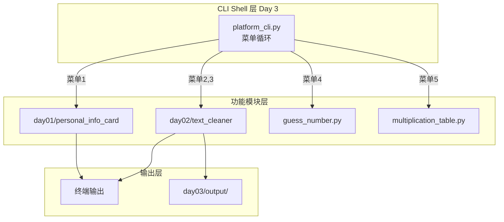

# Day 3 架构设计：平台 CLI Shell（v0.3）

**文档编号**：ZL-NA-ARCH-003  
**版本**：v0.3.0

---

## 1. CLI 层次架构



## 2. 目录结构

```
src/day03/
├── __init__.py
├── constants.py
├── platform_cli.py       # 主入口：菜单 + 功能路由
├── guess_number.py       # 猜数字游戏
├── multiplication_table.py
├── module_loader.py      # 跨 day 模块加载器
└── output/               # 批量清洗输出（gitignore）
    └── .gitkeep
```

## 3. 控制流设计

```python
# platform_cli.py 核心模式
while True:
    show_menu()
    choice = input("请选择：").strip()
    if choice == "0":
        break
    elif choice == "1":
        run_onboarding()
    elif choice == "2":
        run_single_clean()
    # ...
    else:
        print("无效选择")
```

## 4. 跨 Day 模块加载

Day 10 前各 day 目录独立，通过 `module_loader.py` 用 importlib 加载：

```python
day01_card = load_day_module("day01", "personal_info_card")
day01_card.main()

day02_cleaner = load_day_module("day02", "text_cleaner")
day02_cleaner.clean_text(...)
```

## 5. 错误处理策略（Day 3 简化版）

| 错误类型 | 处理方式 | Day 6 升级 |
|----------|----------|------------|
| 文件不存在 | print 提示，返回菜单 | FileNotFoundError |
| 模块加载失败 | print 提示 | 自定义异常 |
| 用户 Ctrl+C | 捕获 KeyboardInterrupt | signal handler |
| 未知异常 | print 错误信息 | logging 模块 |

```python
try:
    handler()
except KeyboardInterrupt:
    print("\n操作已取消")
except Exception as e:
    print(f"❌ 发生错误：{e}")
```

## 6. 可扩展性设计

未来菜单项扩展只需：

```python
MENU_HANDLERS["8"] = handle_todo_list  # Day 4
MENU_HANDLERS["9"] = handle_json_parse  # Day 5
```

无需修改主循环结构——开闭原则的早期实践。

## 7. 部署视角（Day 56 预习）

platform_cli 未来将被打包进 Docker 镜像的 ENTRYPOINT：

```dockerfile
# Day 56 预览
CMD ["python", "-m", "nexus.cli"]
```

今天的菜单 Shell 是容器内运维工具的雏形。

---

*下一篇：[04_流程图与示意图.md](04_流程图与示意图.md)*
