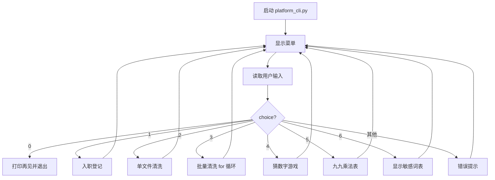
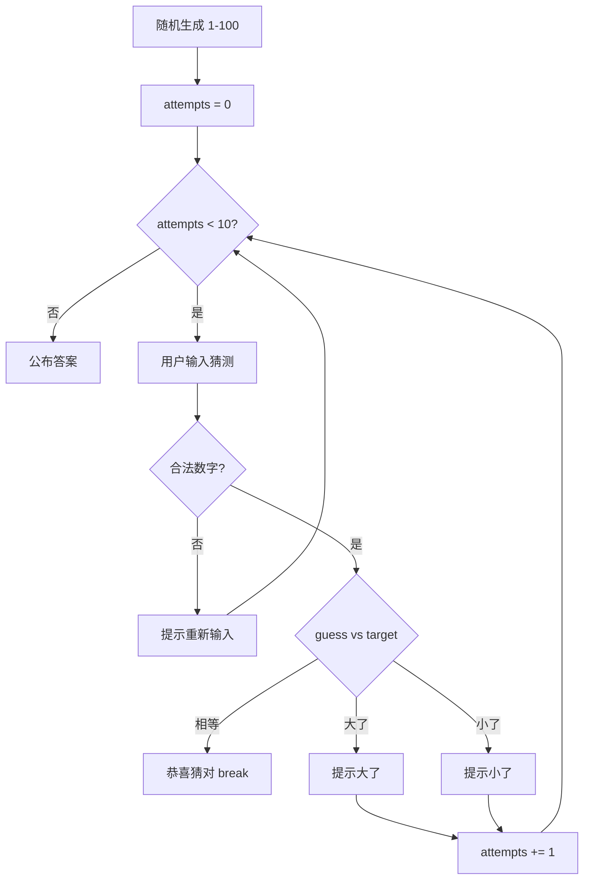

# Day 3 流程图与示意图

## 1. 平台 CLI 主循环



## 2. 猜数字游戏流程



## 3. for 循环批量清洗

```
sample_docs/
├── raw_notice.txt  ──> output/cleaned_raw_notice.txt
├── raw_faq.txt     ──> output/cleaned_raw_faq.txt
└── raw_policy.txt  ──> output/cleaned_raw_policy.txt

for path in sample_dir.glob("*.txt"):
    raw = path.read_text()
    cleaned, stats = clean_text(raw)
    out_path.write_text(cleaned)
```

## 4. break vs continue

```
break:    跳出整个循环（猜对后结束游戏）
continue: 跳过本次迭代，进入下一次（打印乘法表时跳过某行）
```

## 5. platform_cli 菜单状态图

```
        ┌─────────┐
        │  主菜单  │◄────────────┐
        └────┬────┘             │
             │ choice           │
    ┌────────┼────────┐        │
    ▼        ▼        ▼        │
  功能1    功能2    功能3 ...   │
    │        │        │        │
    └────────┴────────┴────────┘
              │
         choice == "0"
              ▼
           [退出]
```

## 6. for-else 与 while-else

```python
# for-else：循环完整执行完（未 break）时执行 else
for x in items:
    if x == target:
        print("found")
        break
else:
    print("not found")

# while-else：条件变 False 且未 break 时执行
# 猜数字次数用尽即此类
```

---

*配合课堂笔记阅读。建议打印本页流程图贴在显示器旁，编写 platform_cli 时对照。*
