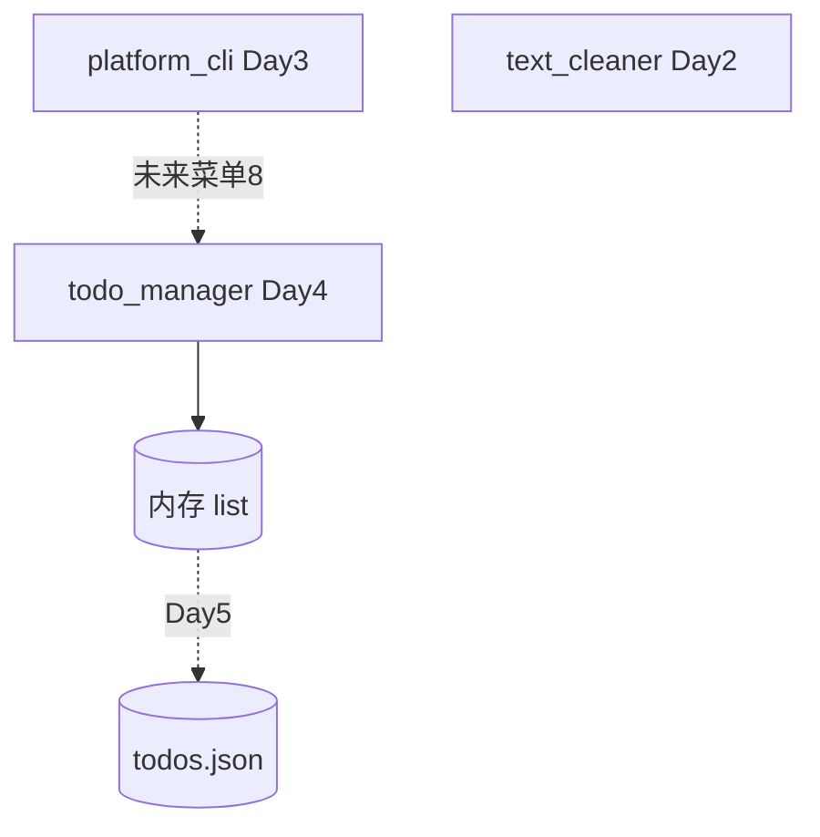

# Day 4 架构设计：任务数据层（v0.4）

**文档编号**：ZL-NA-ARCH-004

## 1. 在平台中的位置



## 2. 模块结构

```
src/day04/
├── constants.py
├── todo_manager.py      # 主程序
├── list_demos.py        # 课堂示例
└── exercises/
```

## 3. list 作为数据结构的选型

| 方案 | Day | 优点 |
|------|-----|------|
| list of list | 4 | 简单，练基本功 |
| list of dict | 5 | 可读性好 |
| Todo 类 | 8 | 面向对象 |
| SQLAlchemy Model | 24 | 持久化 |

## 4. 企业场景映射

| list 操作 | NexusAgent 场景 |
|-----------|-----------------|
| append | 添加 message 到对话历史 |
| 切片 | 取最近 N 轮对话（窗口记忆） |
| sorted | Rerank 结果按分数排序 |
| 推导式 | 过滤低分 chunk |
| set | 工具名去重 |

---

*下一篇：[04_流程图与示意图.md](04_流程图与示意图.md)*
