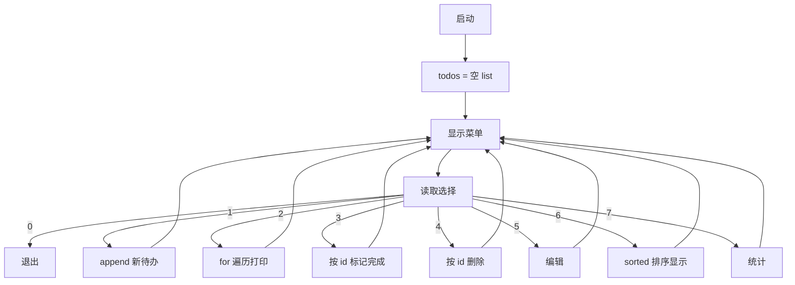

# Day 4 流程图与示意图

## 1. 待办管理器主循环



## 2. list 内存示意图

```
todos = [
  [1, "清洗文档", "...", 1, False],  # index 0
  [2, "写测试",   "...", 2, True ],  # index 1
  [3, "Code Review", ..., 1, False], # index 2
]
         ↑
    todos[1][1] == "写测试"
```

## 3. 列表操作速查

```
创建:    todos = []
添加:    todos.append(item)
插入:    todos.insert(0, item)
删除:    todos.pop(i) / del todos[i]
修改:    todos[i][1] = "新标题"
长度:    len(todos)
排序:    sorted(todos, key=...)
推导:    [t for t in todos if not t[4]]
```
