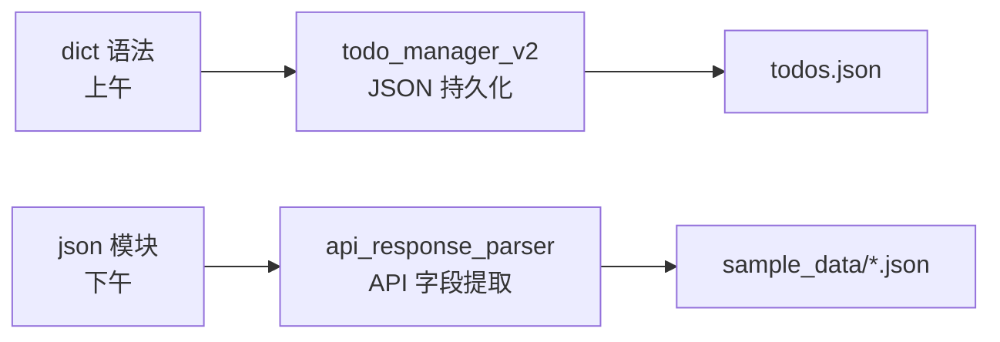

# Day 5 旁白解读：JSON，大模型世界的「普通话」

> **前置要求**：完成 Day 1-4

---

## 旁白

2026 年 7 月 10 日，星期五。

周航在 `#nexus-agent-api` 频道贴了一段 DeepSeek API 返回（脱敏）：

```json
{
  "id": "chatcmpl-xxx",
  "choices": [{
    "message": {
      "role": "assistant",
      "content": "理财产品年化收益约 3.5%-4.2%..."
    },
    "finish_reason": "stop"
  }],
  "usage": {
    "prompt_tokens": 128,
    "completion_tokens": 56,
    "total_tokens": 184
  }
}
```

他说：

> 「从今天开始，你们必须能**闭眼解析这种 JSON**。每次调大模型 API，返回的都是 JSON。不会 dict 和 json 模块，后面 60 天全白学。」

林薇补充：

> 「Day 4 的待办存在内存里，一关终端就没了。今天改成 **dict 存数据 + JSON 写文件**，关机不丢。这也是企业应用的标准做法。」

---

## 今天的双线任务



1. **升级待办管理器**：list → dict，落地 `todos.json`
2. **API 响应解析器**：从模拟 JSON 提取 content、tokens、model

---

## 今日结束后，你应该能够——

1. 熟练 dict 增删改查、嵌套访问、遍历
2. 使用 `json.loads/dumps/load/dump`
3. 理解 JSON 与 Python 类型对应关系
4. 从嵌套 API 响应中提取指定字段
5. 运行 `todo_manager_v2.py`，重启后数据仍在

---

*下一篇：[01_企业背景与今日任务.md](01_企业背景与今日任务.md)*
