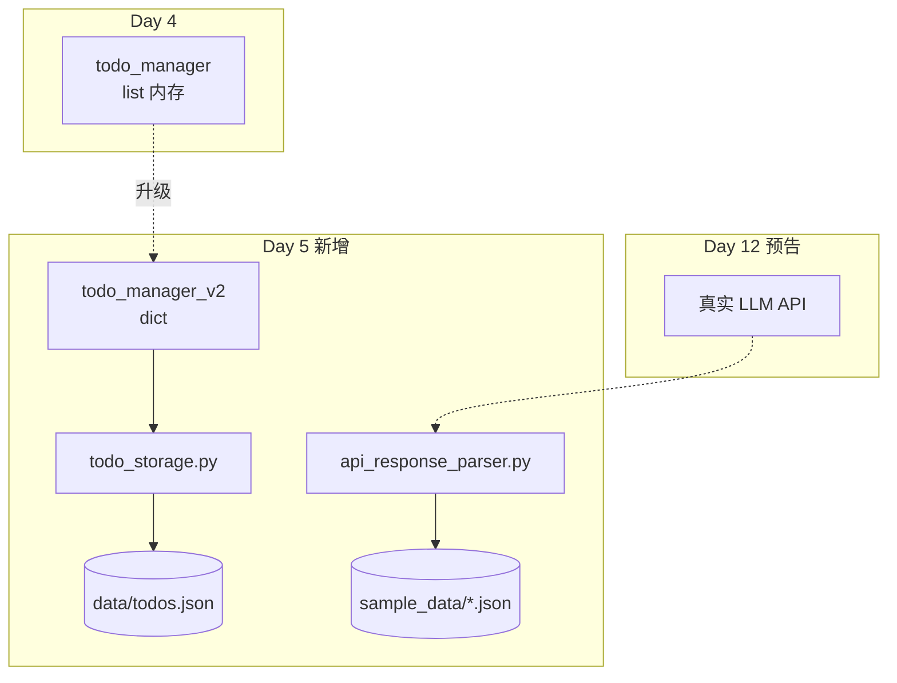

# Day 5 架构设计：数据持久化与 API 解析层（v0.5）

**文档编号**：ZL-NA-ARCH-005

## 1. 架构图



## 2. 模块结构

```
src/day05/
├── constants.py
├── todo_storage.py       # JSON 读写
├── todo_manager_v2.py    # 升级版待办
├── api_response_parser.py
├── dict_demos.py
├── data/
│   └── todos.json
└── sample_data/
    ├── chat_completion.json
    ├── stream_chunk.json
    └── error_response.json
```

## 3. JSON 在平台中的位置

| 场景 | JSON 用途 |
|------|-----------|
| LLM API | 请求/响应体 |
| todos.json | 本地配置持久化 |
| Day 7 通讯录 | contacts.json |
| Day 24 | API 请求体 Pydantic → JSON |
| Day 56 | docker-compose.yml 邻域配置 |

---

*下一篇：[04_流程图与示意图.md](04_流程图与示意图.md)*
