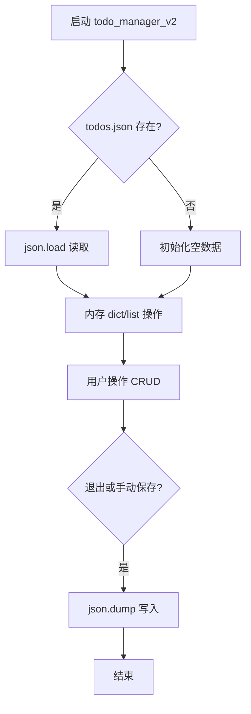

# Day 5 流程图与示意图

## 1. dict 访问嵌套 JSON

```
response = {
  "choices": [
    { "message": { "content": "你好" } }
  ]
}

response["choices"][0]["message"]["content"]
     │         │         │          └── 字符串
     │         │         └── dict
     │         └── list 第 0 项
     └── 顶层 dict
```

## 2. todos 持久化流程



## 3. Python 与 JSON 类型映射

| Python | JSON |
|--------|------|
| dict | object {} |
| list | array [] |
| str | string |
| int/float | number |
| True/False | true/false |
| None | null |

**不支持**：tuple、set、datetime（需转 str）

## 4. json 四种方法

```
字符串 ←── loads ── JSON文本
字符串 ── dumps ──→ JSON文本

文件   ←── load  ── JSON文件
文件   ── dump  ──→ JSON文件
```
