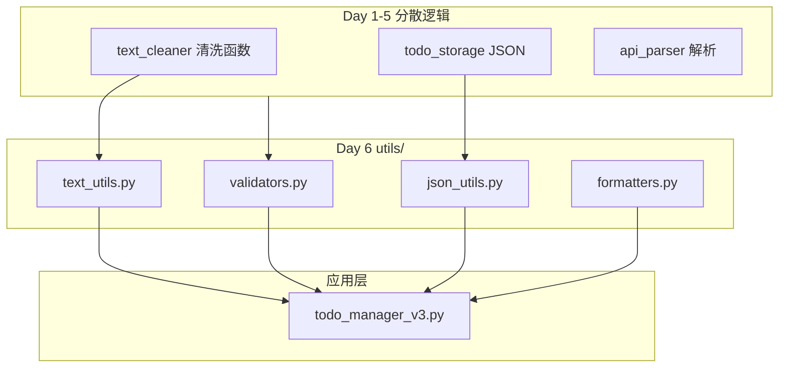

# Day 6 旁白解读：函数，从「写脚本」到「写工程」

> **前置要求**：完成 Day 1-5

---

## 旁白

2026 年 7 月 11 日，星期六（调休上班）。

陈默主持 Sprint 1 中期 Code Review。他打开三个同学的 `todo_manager_v2.py`、`text_cleaner.py`、`api_response_parser.py`，用红笔圈出多处重复代码：

```python
# 同学 A
if not title.strip():
    print("标题不能为空")

# 同学 B — 几乎一样的逻辑
if not name:
    print("姓名不能为空")

# 同学 C — JSON 读取写了两遍
with open(path) as f:
    data = json.load(f)
```

陈默：

> 「你们三个人写了三个版本的『输入不能为空』和『读 JSON 文件』。工程化的第一步：**把重复逻辑抽成函数，放进 utils 包，全项目复用。**
>
> 今天学函数，不是为了语法考试。Day 10 我们要做包结构重组，Day 14 的对话助手、Day 30 的 RAG 流水线——**全是函数和函数的组装。**」

林晓在旁白文档里补充：**函数是「命名了的意图」**。当你看到 `load_json(path)`，不需要读 10 行实现就知道在加载配置；当你看到 `if not x: print(...)` 重复出现，就知道该抽 `require_non_empty` 了。

---

## 今日重构范围



**数据流不变**：`todo_manager_v3` 仍然读写 `day05/data/todos.json`。重构只改变**代码组织**，不改变用户可见行为——这是专业与不专业的分水岭。

---

## 为什么今天是转折点

| 阶段 | Day 1-5 | Day 6 起 |
|------|---------|----------|
| 代码形态 | 单文件脚本 | 分层 + 工具库 |
| 复用方式 | 复制粘贴 | import 函数 |
| 测试策略 | 手工运行 | pytest 单测 |
| 心智模型 | 「能跑就行」 | 「别人能改」 |

赵岩在架构会上画了一张图：最底层是 Python 标准库，往上是 `utils`，再上是 `dayXX` 教学模块，未来是 `services` 和 `api`。**依赖只能向上，不能向下**——utils 绝不能 import `todo_manager_v3`。

---

## 今日结束后，你应该能够——

1. 定义函数、理解参数与返回值
2. 使用 `*args`、`**kwargs`、默认参数与仅关键字参数
3. 理解 LEGB 作用域；谨慎使用 `global` / `nonlocal`
4. 写 lambda 与简单递归；知道何时用 `def` 更合适
5. 将 Day 1-5 重复逻辑抽取到 `src/utils/`
6. 运行 `todo_manager_v3.py`（基于 utils 重构版）
7. 编写并通过 `tests/test_utils.py`

---

## 与明日 Day 7 的衔接

Day 7 是第一周复盘 + **通讯录管理器**小项目。你会用到今天的 `validate_email`、`require_non_empty`、`load_json` / `save_json`，把「函数 + JSON 文件」的组合再练一遍。今天 utils 打不好地基，明天会反复踩 import 和校验的坑。

---

*下一篇：[01_企业背景与今日任务.md](01_企业背景与今日任务.md)*
