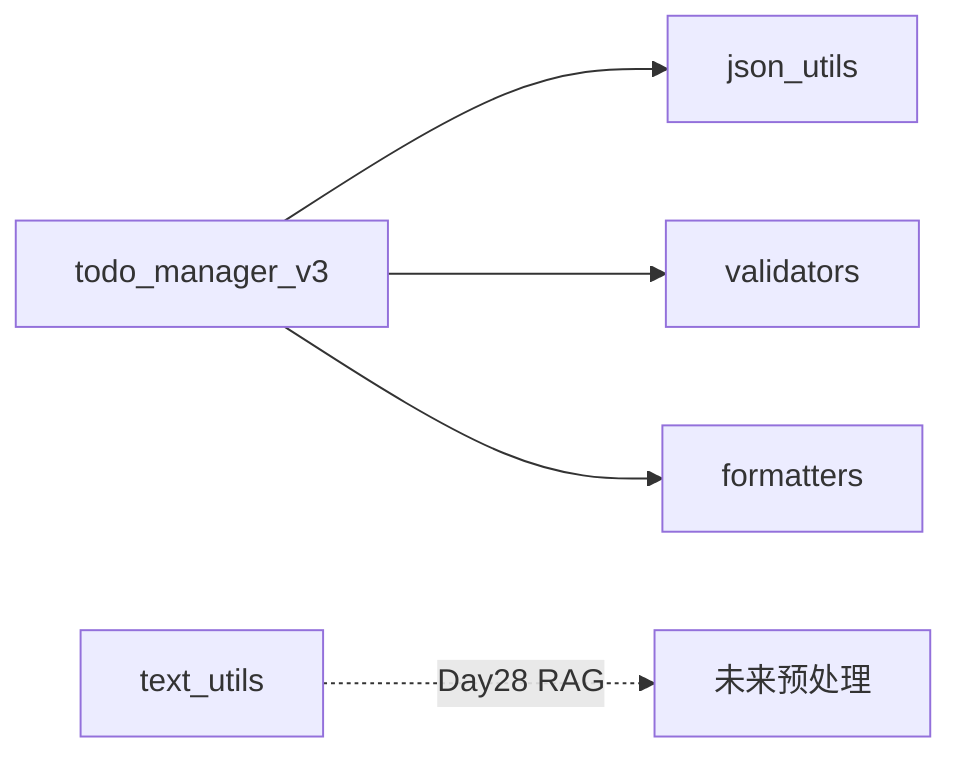

# Day 6 架构设计

## 1. 分层架构

```
┌─────────────────────────────────────┐
│  CLI 应用层 (day06/todo_manager_v3) │
│  handle_add / main / show_menu      │
├─────────────────────────────────────┤
│  工具层 (utils/*)                    │
│  json / text / validators / format  │
├─────────────────────────────────────┤
│  标准库 + 第三方                     │
│  json, pathlib, re                  │
└─────────────────────────────────────┘
```

## 2. 模块依赖图



`todo_manager_v3` **不依赖** `text_utils`（今日），但包内已就位供后续使用。

## 3. 数据模型（沿用 Day 5）

```json
{
  "version": "1.0",
  "next_id": 3,
  "updated_at": "2026-07-11T08:00:00Z",
  "todos": [
    {
      "id": 1,
      "title": "示例",
      "description": "",
      "priority": 2,
      "done": false,
      "created_at": "..."
    }
  ]
}
```

## 4. 函数粒度原则

| 类型 | 行数建议 | 示例 |
|------|----------|------|
| 工具函数 | 5-25 行 | `parse_priority` |
| 业务处理 | 10-40 行 | `handle_add` |
| 编排 main | 20-50 行 | `main` while 循环 |

超过 50 行考虑拆分；`clean_text` 管道式函数例外。

## 5. 测试架构

```
tests/
├── test_utils.py          # 单元测试 — 快、无交互
└── day06/
    └── test_todo_manager_v3.py  # 集成 — 临时 JSON
```

CLI 的 `input()` 不纳入自动化测试；通过测 `load_store` / `create_todo` 等纯函数覆盖核心逻辑。

## 6. 演进路线

| 版本 | Day | 变化 |
|------|-----|------|
| v1 | 4 | list 内存 |
| v2 | 5 | dict + JSON |
| v3 | 6 | utils 重构 |
| v4 | 8 | 类封装 TodoService |

---

*流程图：[04_流程图与示意图.md](04_流程图与示意图.md)*
