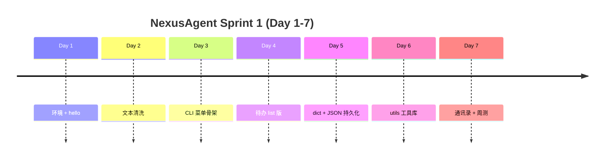

# Day 7 旁白解读：第一周收官，从知识点到交付物

> **前置要求**：完成 Day 1-6

---

## 旁白

2026 年 7 月 12 日，星期日。

智链科技培训教室比平时安静——今天是**第一周复盘日**，也是 Sprint 1 的**评审日**。墙上投影着一张时间表：Day 1 的 `hello.py`、Day 4 的待办列表、Day 5 的 JSON 文件、Day 6 的 `utils/` 目录，像一串脚印通向今天的终点。

陈默站在白板前：

> 「前六天你们学了变量、字符串、流程控制、list、dict、JSON、函数。今天不做新语法堆砌。**上午串讲，下午交付 Sprint 1 收官项目——通讯录管理系统。**
>
> 为什么做通讯录？因为待办管理器你们已经写过两版了。通讯录字段不同（姓名、手机、邮箱、分组），但**模式相同**：菜单 → 校验 → dict → JSON → utils。能独立做出通讯录，说明第一周真的学会了。」

赵岩补充：

> 「通讯录的数据以后会进 Agent 的「联系人工具」——用户说『给陈默发邮件』，Agent 要能从 JSON 里查到 `chenmo@zhilian-tech.com`。今天存进 `contacts.json` 的每一条记录，都是未来平台的种子数据。」

---

## Sprint 1 回顾：我们建了什么

| Day | 核心技能 | 平台产出 |
|-----|----------|----------|
| 1 | 环境、变量、print | 项目仓库、个人信息卡 |
| 2 | 字符串、运算符 | text_cleaner |
| 3 | if/while/for | platform_cli 菜单 |
| 4 | list/tuple/set | todo_manager v1 |
| 5 | dict、JSON | todo_manager v2、API 解析器 |
| 6 | 函数、utils | todo_manager v3 |
| **7** | **综合应用** | **contacts_manager** |

---

## 今日双主线

**主线 A — 复习**：`week1_quiz.py` 10 道选择题，覆盖 Day 1-6。及格线 60 分，建议做完再写代码。

**主线 B — 交付**：`contacts_manager.py` 实现增删改查、按姓名/分组搜索、分组统计、JSON 持久化，**必须**调用 `utils` 中的 `validators` 与 `formatters`。

---

## 今日结束后，你应该能够——

1. 口述 Day 1-6 知识脉络，画出 NexusAgent CLI 演进图
2. 独立完成带菜单的 dict + JSON CRUD 应用（通讯录）
3. 正确使用 `validate_phone`、`validate_email`、`require_non_empty`
4. 将业务逻辑拆到 `contact_service.py`，CLI 只做编排
5. 通过周测（≥60 分）与 `pytest tests/day07/`

---

## 与 Day 8 的衔接

明天进入**面向对象**。`contact` 将从 dict 升级为 `Contact` 类（Day 8 的 `ChatMessage` 同理）。今天用 dict 写通讯录是故意的——先理解**数据与行为分离**，再学 `class` 封装。

---

*下一篇：[01_企业背景与今日任务.md](01_企业背景与今日任务.md)*
