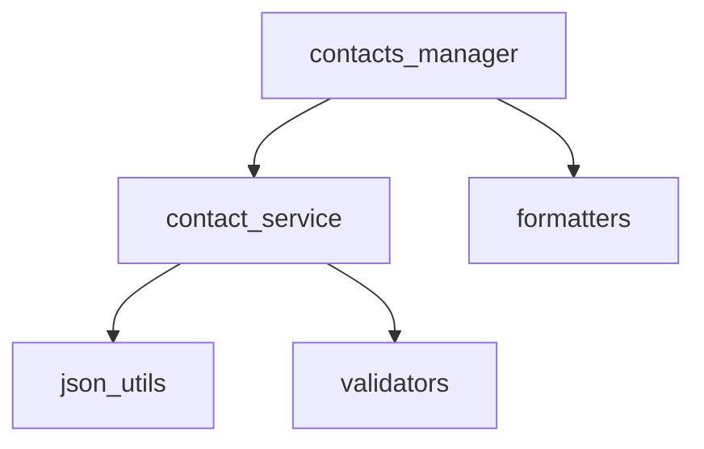

# Day 7 架构设计

## 1. 三层结构

```
┌──────────────────────────────────────────┐
│  CLI 层  contacts_manager.py              │
│  菜单、input、print、流程编排              │
├──────────────────────────────────────────┤
│  业务层  contact_service.py               │
│  add/search/update/delete/stats           │
├──────────────────────────────────────────┤
│  工具层  utils/*                           │
│  json_utils / validators / formatters     │
└──────────────────────────────────────────┘
```

与 `todo_manager_v3` 对比：Day 6 业务函数仍在同一文件；Day 7 **显式拆分 service 层**，为 Day 8 类封装铺路。

## 2. 依赖关系



**禁止**：`contact_service` import `contacts_manager`；`utils` import `day07`。

## 3. 与待办管理器的模式对照

| 概念 | 待办 v3 | 通讯录 |
|------|---------|--------|
| store 根键 | todos | contacts |
| 主键 | id | id |
| 自增 | next_id | next_id |
| 校验 | title 非空 | name/phone/email |
| 搜索 | 无 | 姓名/分组 |
| 统计 | 完成数 | 分组人数 |

## 4. 扩展点（未来）

- Day 8：`Contact` 类封装字段与 `validate()`
- Day 11：从 CSV 批量导入联系人
- Day 39：Agent 工具 `lookup_contact(name) -> email`
- Day 23：FastAPI `GET /contacts?group=研发部`

## 5. 测试策略

| 层级 | 测什么 | 不测什么 |
|------|--------|----------|
| service | add/search/save | input() |
| utils | validate_phone | CLI 菜单 |
| quiz | 题目结构 | 交互得分 |

---

*流程图：[04_流程图与示意图.md](04_流程图与示意图.md)*
