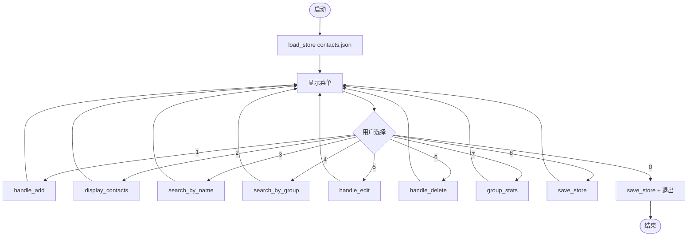
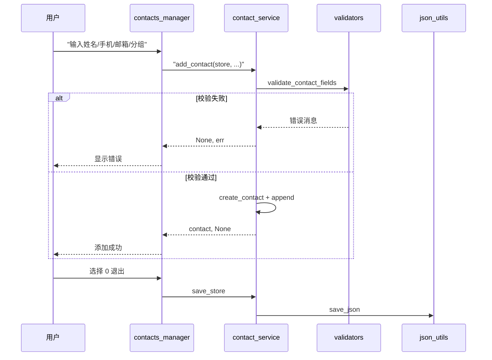
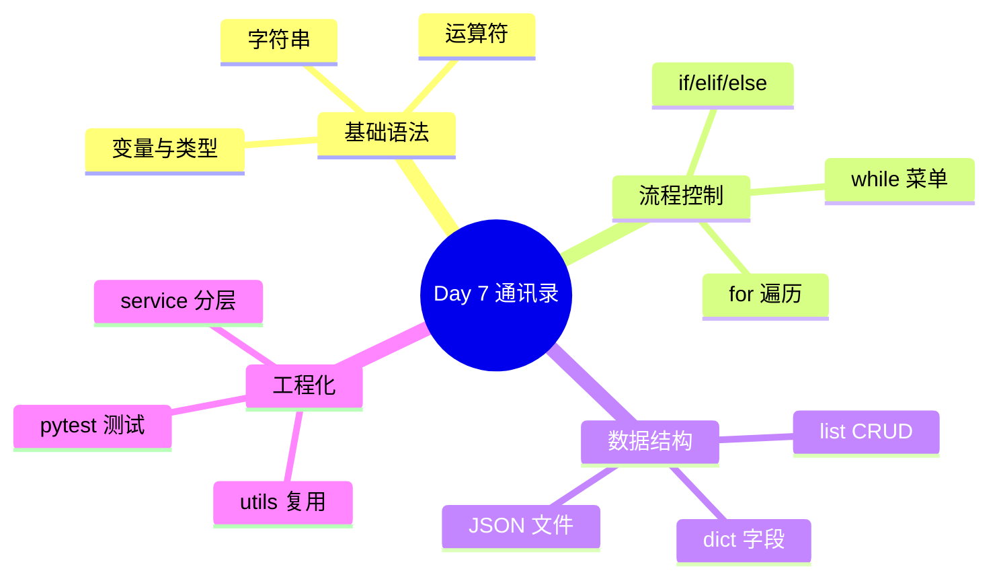

# Day 7 流程图与示意图

## 1. 通讯录主流程



## 2. 添加联系人时序



## 3. Sprint 1 技能栈



## 4. 周测流程

```
开始 → 显示第 1 题 → 用户输入选项 → 判分 → ... → 第 10 题 → 输出总分 → 及格/不及格提示
```

---

*课堂笔记：[05_课堂笔记_上午.md](05_课堂笔记_上午.md)*
