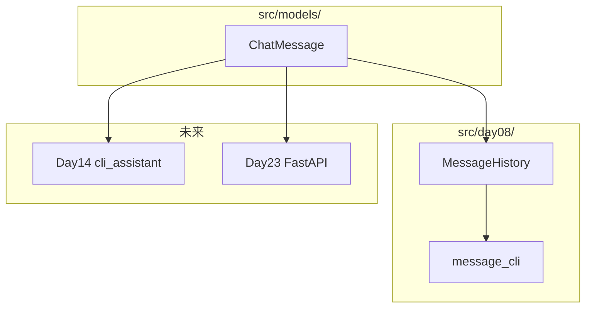

# Day 8 旁白解读：从 dict 到 class，对话系统的第一块基石

> **前置要求**：完成 Day 1-7

---

## 旁白

2026 年 7 月 13 日，星期一。Sprint 2 启动。

陈默在白板上画了两个并排方框：

```
Day 7 联系人 dict          Day 8 ChatMessage 类
{"name":"陈默",...}   →    msg.role / msg.content
函数 validate_contact      msg.validate()
```

> 「上周你们用 dict 存联系人，用函数操作 dict——这叫**贫血模型**，数据和行为分开。从本周开始，NexusAgent 进入**对话时代**，核心实体是**一条消息**。今天把它封装成 `ChatMessage` 类：数据（role、content）和行为（validate、to_dict、format_line）绑在一起。」

赵岩打开 Day 5 的 `chat_completion.json`：

```json
"message": {
  "role": "assistant",
  "content": "根据产品说明书..."
}
```

> 「API 返回的就是 message 对象。我们不再用裸 dict 传递，而是用 `ChatMessage.from_dict()` 构造类型明确的实例。Day 12 调真 API、Day 14 多轮对话、Day 23 FastAPI，全部站在今天这个类上。」

---

## 为什么今天学面向对象

| 阶段 | 数据形态 | 局限 |
|------|----------|------|
| Day 4-5 | list of dict | 字段拼写错误运行时才暴露 |
| Day 6-7 | dict + 函数 | 函数与数据分离，易散落 |
| **Day 8+** | **class** | 封装、校验、序列化一体 |

Python 是多范式语言，但企业项目里**领域模型**（Domain Model）通常用 class 表达：`ChatMessage`、`Contact`、`User`、`Document`。

---

## 今日架构位置



---

## 今日结束后，你应该能够——

1. 定义 class、`__init__`、实例方法与 `@classmethod`
2. 实现 `to_dict` / `from_dict` 与 API 格式互转
3. 理解 `__str__` / `__repr__` / `__eq__` 的作用
4. 使用 `MessageHistory` 管理多轮消息并导出 API 格式
5. 运行 `message_cli.py` 构建对话记录

---

## 林晓的学习建议

> 「第一次写 class 觉得比 dict 麻烦是正常的。麻烦换来的是：**改字段名时 IDE 会帮你重构，校验逻辑不会散落在五个文件里。** 今天只要记住一个类 `ChatMessage`、三个魔术方法 `__init__`/`__str__`/`__eq__`、两个导出 `to_dict`/`to_api_message`，就达标了。」

建议学习顺序：先看 `oop_demos.py` 五分钟 → 精读 `models/message.py` → 跑 `message_cli` → 最后读 `message_history.py`。

---

*下一篇：[01_企业背景与今日任务.md](01_企业背景与今日任务.md)*
