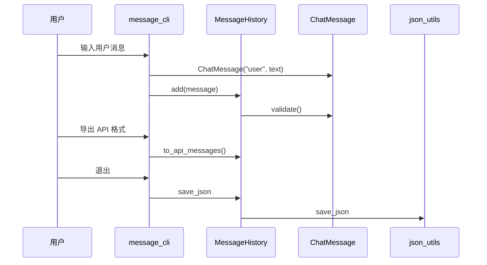

# Day 8 架构设计

## 1. 包结构

```
src/
├── models/              # 领域模型（长期）
│   ├── __init__.py
│   └── message.py       # ChatMessage
├── day08/               # 当日实验与 CLI
│   ├── message_history.py
│   ├── message_cli.py
│   ├── oop_demos.py
│   └── contact_class.py
└── utils/               # 横切工具（不变）
```

**原则**：`models` 不依赖 `day08`；`day08` 可依赖 `models`。

## 2. 数据流



## 3. dict → class 映射

| Day 7 Contact dict | Day 8 ChatMessage |
|--------------------|-------------------|
| d["role"] | msg.role |
| d["content"] | msg.content |
| validate_contact_fields(d) | msg.validate() |
| json 读写 | to_dict / from_dict |

## 4. 与后续模块关系

| 模块 | Day | 使用 ChatMessage |
|------|-----|------------------|
| cli_assistant | 14 | 多轮对话循环 |
| llm/client | 12 | 组装 messages 数组 |
| api/chat | 23 | 请求体验证 |
| agent/tools | 39 | 工具返回转 assistant 消息 |

---

*流程图：[04_流程图与示意图.md](04_流程图与示意图.md)*
