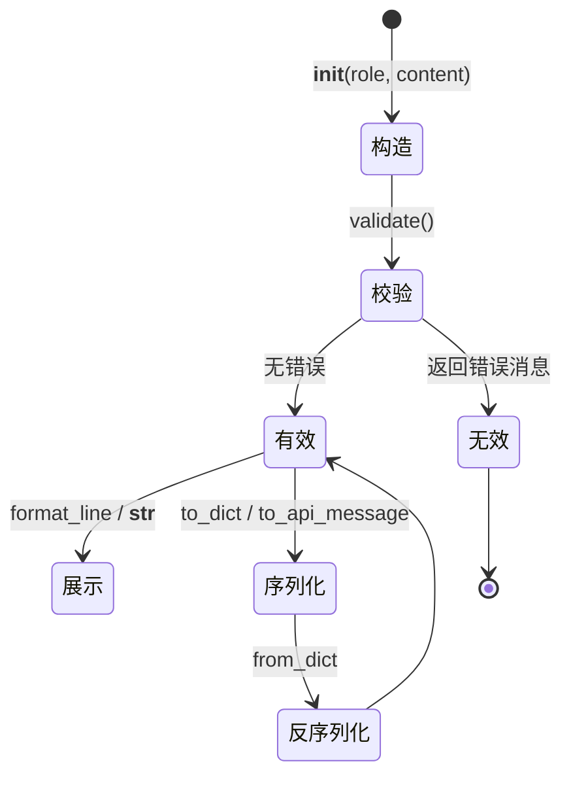
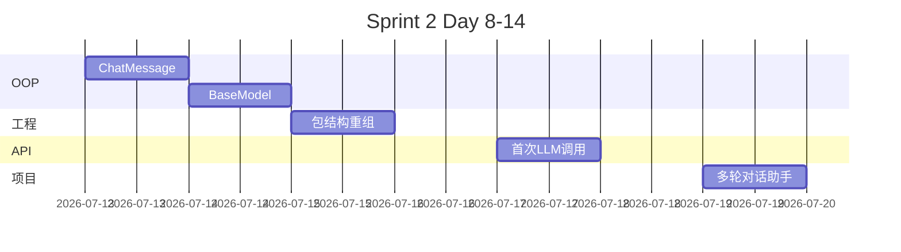

# Day 8 流程图与示意图

## 1. ChatMessage 生命周期



## 2. MessageHistory 结构

```
MessageHistory
└── _messages: list[ChatMessage]
    ├── [0] ChatMessage(system, ...)
    ├── [1] ChatMessage(user, ...)
    └── [2] ChatMessage(assistant, ...)
```

## 3. Sprint 2 路线图（预览）



## 4. 类与对象关系（UML 简图）

```
┌─────────────────────┐
│     ChatMessage     │
├─────────────────────┤
│ - role: str         │
│ - content: str      │
│ - created_at: str   │
├─────────────────────┤
│ + validate()        │
│ + to_dict()         │
│ + to_api_message()  │
│ + format_line()     │
└─────────────────────┘
         △
         │ 0..*
┌─────────────────────┐
│   MessageHistory    │
├─────────────────────┤
│ - _messages: list   │
├─────────────────────┤
│ + add()             │
│ + to_api_messages() │
└─────────────────────┘
```

---

*课堂笔记：[05_课堂笔记_上午.md](05_课堂笔记_上午.md)*
