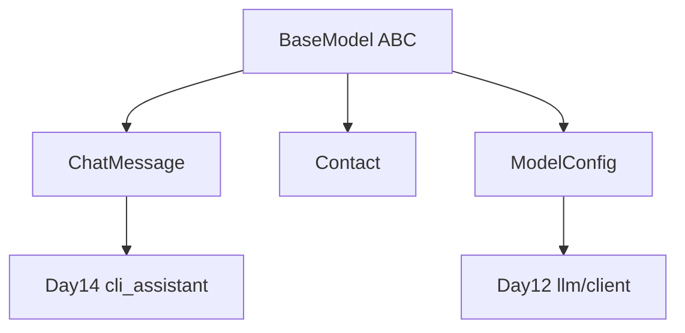

# Day 9 旁白解读：抽象类，给模型立法

> **前置要求**：完成 Day 1-8

---

## 旁白

2026 年 7 月 14 日。陈默在白板上写了三个类名：`ChatMessage`、`Contact`、`ModelConfig`。

> 「昨天你们各自实现了 `validate` 和 `to_dict`，写法差不多，但**没有强制约束**。今天立一部『模型宪法』——**BaseModel 抽象基类**。凡是 NexusAgent 的领域对象，必须实现 validate、to_dict、from_dict。不实现的子类，**连实例化都不允许**。」

赵岩打开 `llm_base.py`：

```python
class BaseModel(ABC):
    @abstractmethod
    def validate(self) -> str | None: ...
```

> 「这就是抽象方法。子类**必须**覆盖，否则 Python 在实例化时直接 TypeError。Day 12 的 LLM 客户端只接受 `BaseModel` 列表做批量校验；Day 39 Agent 工具注册表也是这个模式。」

---

## 今日在架构中的位置



---

## 林晓的学习建议

> 「昨天刚会 class，今天加一层 BaseModel 抽象，觉得绕是正常的。记住一张图：**所有模型都做同三件事——校验、导出、还原。** 具体规则写在子类，宪法写在 BaseModel。」

建议今日三遍运行：

1. `inheritance_demos.py` — 理解 ABC  
2. 单步调试 `ensure_valid` 抛错路径  
3. `polymorphism_demo.py` — 看注册表统计  

---

## 与 Day 10 的衔接

明天不新增模型，而是**整理 import 路径、异常体系、包结构**。`models/` 目录今日定型，Day 10 将把 `llm/`、`chat/` 骨架 mkdir 出来。

---

*下一篇：[01_企业背景与今日任务.md](01_企业背景与今日任务.md)*
