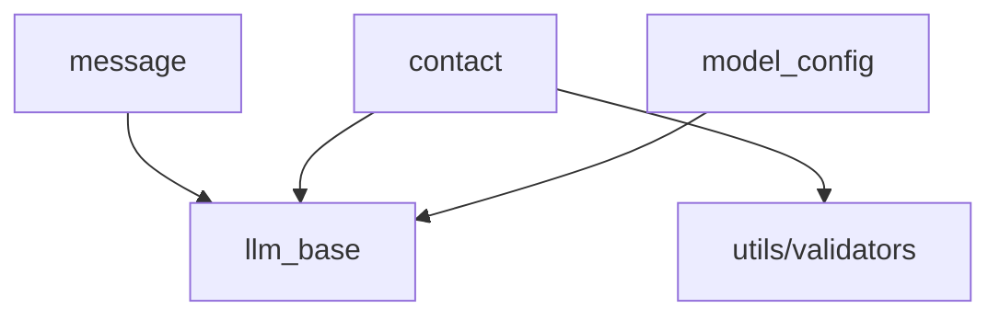

# Day 9 架构设计

## 1. models 包结构（Day 9 后）

```
src/models/
├── __init__.py      # 统一导出
├── llm_base.py      # BaseModel, ModelValidationError
├── message.py       # ChatMessage
├── contact.py       # Contact
└── model_config.py  # ModelConfig
```

## 2. 依赖规则



`llm_base` 不依赖子类；子类可依赖 `utils`。

## 3. 与 Day 10 包重组预告

Day 10 将把 `dayXX` 教学代码与 `models`/`llm`/`chat` 生产代码目录分离；今日确立的 `models/` 为**生产层**核心。

## 4. 异常策略演进

| Day | 风格 |
|-----|------|
| 6-8 | 返回错误消息 str |
| 9 | ModelValidationError |
| 10 | 自定义异常层次 |
| 23 | HTTPException |

---

*流程图：[04_流程图与示意图.md](04_流程图与示意图.md)*
