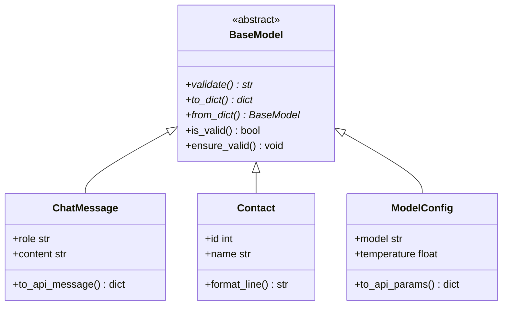

# Day 9 流程图与示意图

## 1. 类继承图



## 2. validate 调用链

```
用户数据 → from_dict → 实例 → validate()
                ↓ 失败
         from_dict_safe → (None, err)
                ↓ 成功
         ensure_valid → to_json_ready → save_json
```

## 3. 多态注册

```
register(ChatMessage)  ─┐
register(Contact)      ─┼→ list[BaseModel] → export_all()
register(ModelConfig)  ─┘
```

---

*课堂笔记：[05_课堂笔记_上午.md](05_课堂笔记_上午.md)*
