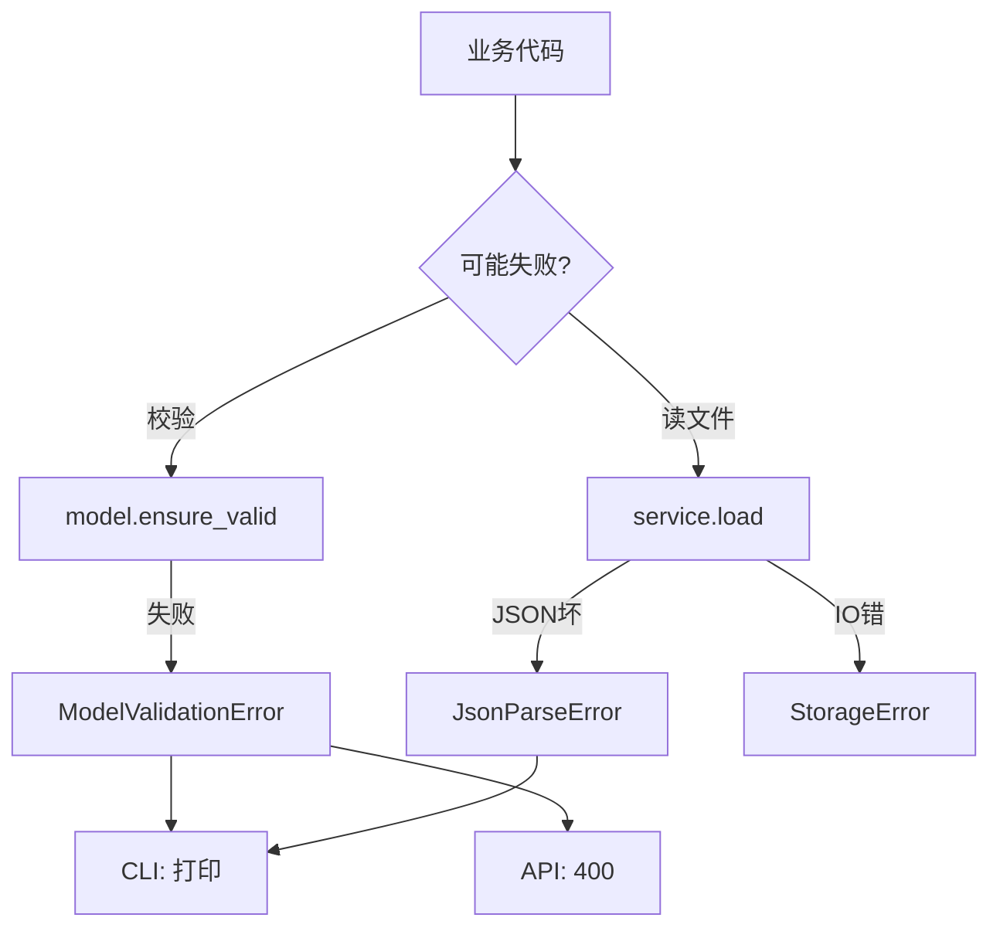
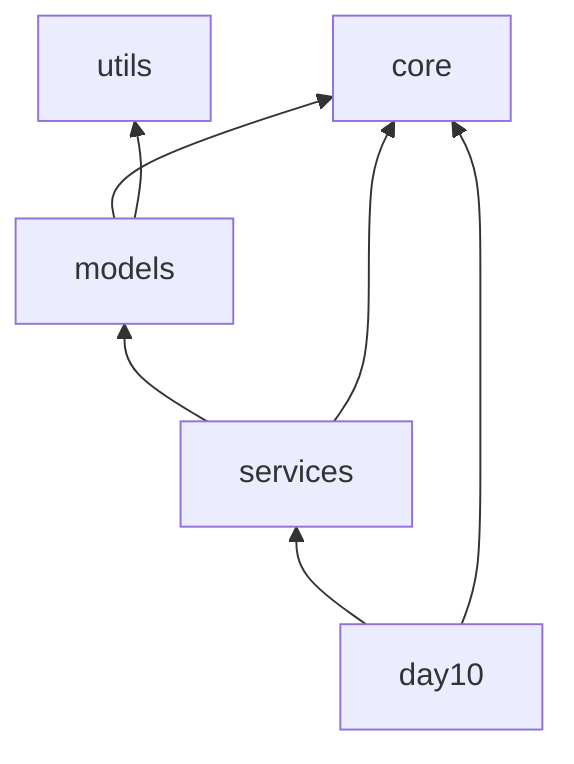

# Day 10 流程图与示意图

## 1. 异常捕获流程


```mermaid
flowchart TD
    A[业务代码] --> B{"可能失败?"}
    B -->|校验| C[model.ensure_valid]
    C -->|失败| D[ModelValidationError]
    B -->|读文件| E[service.load]
    E -->|JSON坏| F[JsonParseError]
    E -->|IO错| G[StorageError]
    D --> H[CLI: 打印]
    D --> I[API: 400]
    F --> H
```

## 2. 包依赖图


```mermaid
graph BT
    core[core]
    utils[utils]
    models[models]
    services[services]
    day10[day10]
    models --> core
    models --> utils
    services --> models
    services --> core
    day10 --> services
    day10 --> core
```

## 3. 模块导入时序

```
setup_python_path() → import core → import models → import services → 运行业务
```

---

*课堂笔记：[05_课堂笔记_上午.md](05_课堂笔记_上午.md)*
