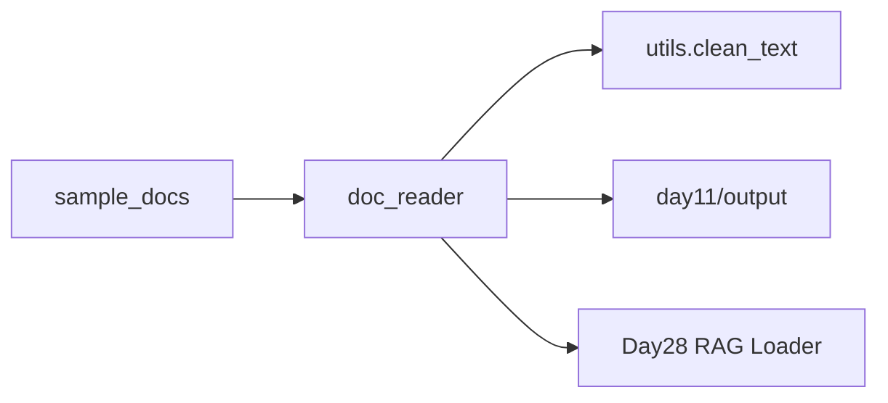

# Day 11 旁白解读：从单文件到批量流水线

> **前置要求**：完成 Day 1-10

---

## 旁白

2026 年 7 月 16 日。赵岩打开智链科技的知识库工单：

> 「上周 OCR 扫了 300 份理财产品说明书，全在共享盘里。Day 2 的 `text_cleaner` 只能一次处理一个文件，Day 3 的批处理写在教学 CLI 里。今天把**读文件 + 遍历目录 + 调用清洗**抽成生产模块 `tools/doc_reader.py`。」

陈默在白板上画了三层：

```
pathlib 读盘 → doc_reader 编排 → utils.clean_text 清洗
```

> 「`tools/` 昨天只是空壳，今天是第一个真正的工具。Day 28 RAG 加载器会直接 import 它，别写死在 dayXX 里。」

林晓问：「编码不对怎么办？」

> 「企业文档 UTF-8 和 GBK 混着来。我们不用第三方 chardet，先用**编码回退链**：utf-8 → gbk → gb2312 → latin-1。读失败统一抛 `StorageError`，和 Day 10 异常体系对齐。」

---

## 今日在架构中的位置



---

## 林晓的学习建议

1. 先跑 `file_demos.py` 理解 `Path.read_text` / `write_text`
2. 再跑 `glob_demos.py` 看 `iter_text_files`
3. 最后 `doc_reader_demo.py` 对照 Day 3 批处理菜单

**三遍原则**：读代码 → 单步调试 `read_text_file` 编码回退 → 改一个样本看输出 diff。

---

## 与 Day 12 的衔接

明日首次调用 LLM API。`doc_reader` 读出的清洗文本，Day 15 以后会作为 Prompt 上下文片段入库。
