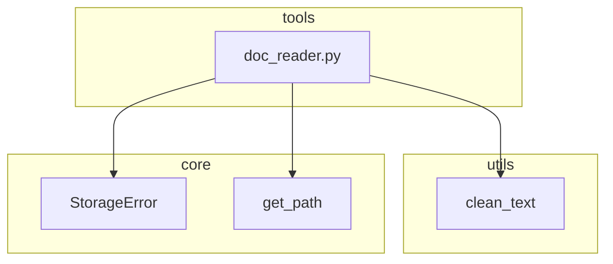

# Day 11 架构设计

## 模块图

## 数据流

1. `get_path("sample_docs")` 定位输入目录
2. `iter_text_files` glob `*.txt`
3. `read_text_file` 解码为 str
4. `clean_text` + 可选手机脱敏
5. `write_cleaned_documents` 写入 `doc_output`

## DocumentRecord 设计

使用 `@dataclass` 而非 BaseModel：只读管道中间态，无需 validate/from_dict。

## 与 Day 3 对比

| 维度 | Day 3 platform_cli | Day 11 doc_reader |
|------|-------------------|-------------------|
| 位置 | day03 教学 | tools 生产 |
| 加载清洗 | importlib 动态 | import utils |
| 异常 | print 错误 | StorageError |
| 路径 | constants 硬编码 | get_path |
