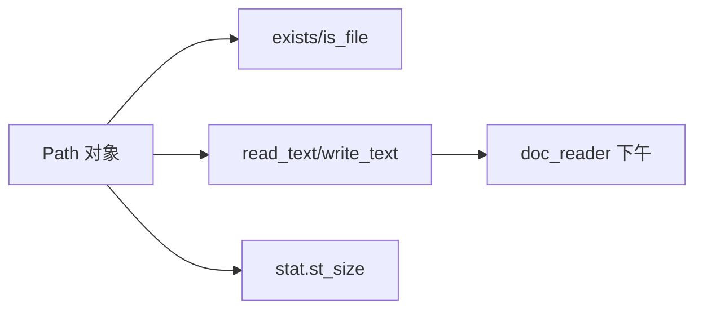

# Day 11 课堂笔记（上午）— pathlib 与文件 IO 基础

**主题**：`pathlib.Path`、文本读写、`stat` 元数据  
**需求**：ZL-NA-REQ-011 前置技能

---

## 第一节：为何不用字符串拼路径（9:00 - 9:35）

陈默在白板上对比两种写法：

```python
# ❌ 旧式 os.path（仍可用，但新项目不推荐）
import os
path = os.path.join("data", "docs", "readme.txt")

# ✅ pathlib（Python 3.4+，Day 11 起统一使用）
from pathlib import Path
path = Path("data") / "docs" / "readme.txt"
```

**企业理由**：

1. `/` 运算符跨平台（Windows 自动转 `\`）
2. `Path` 对象自带 `exists()`、`read_text()`，减少函数跳转
3. 与 `doc_reader.py` 全模块类型注解 `path: Path` 一致

NexusAgent 中 `core/paths.py` 的 `SRC_ROOT`、`PATHS` 全部基于 `Path`，禁止在新代码里写 `"../../day02/sample_docs"` 字符串。

---

## 第二节：Path 对象核心属性（9:35 - 10:15）

以 `get_path("sample_docs")` 返回的路径为例（实际指向 `src/day02/sample_docs`）：

```python
from core.paths import get_path

sample = get_path("sample_docs")
print(sample)           # 绝对路径
print(sample.name)      # sample_docs
print(sample.parent)    # .../day02
print(sample.suffix)    # ''（目录无后缀）
print(sample.exists())  # True
print(sample.is_dir())  # True
print(sample.is_file()) # False
```

### 2.1 路径拼接规则

| 写法 | 结果 |
|------|------|
| `parent / "output"` | 子路径 |
| `Path.home() / ".nexus"` | 用户目录下 |
| `path.with_suffix(".json")` | 改后缀 |
| `path.resolve()` | 绝对化、解析 `..` |

**演示脚本**：`src/day11/file_demos.py` 的 `demo_path_basics()` 打印上述属性。

---

## 第三节：read_text 与 write_text（10:15 - 11:00）

`Path` 将「打开文件 → 读/写 → 关闭」封装为一行：

```python
target = Path("/tmp/nexus_day11_demo.txt")

# 写入 UTF-8 文本（默认 encoding="utf-8" 从 3.10 起可省略，我们显式指定）
target.write_text("  智链科技   内部资料  \n", encoding="utf-8")

# 读回
raw = target.read_text(encoding="utf-8")
print(repr(raw))  # 保留首尾空白
```

### 3.1 与 open() 的对应关系

```python
# 等价于：
with open(target, "w", encoding="utf-8") as f:
    f.write("...")
```

**团队规范**：简单全文读写用 `read_text`/`write_text`；超大文件（Day 28）再改流式 `open`。

### 3.2 二进制读写

```python
path.write_bytes(b"\xff\xfe")
data = path.read_bytes()  # doc_reader 编码回退前先读 bytes
```

`read_text_file` 内部调用 `path.read_bytes()`，再按编码列表 `decode`，这是上午与下午课程的衔接点。

---

## 第四节：stat() 与文件元数据（11:00 - 11:45）

```python
st = target.stat()
print(st.st_size)      # 字节数 → DocumentRecord.size_bytes
print(st.st_mtime)     # 修改时间戳
print(st.st_mode)      # 权限位（了解）
```

`DocumentRecord` 在 `read_document` 里用 `path.stat().st_size` 记录原始文件大小，供 `doc_reader_demo.py` 计算压缩率：

```python
ratio = (raw_len - clean_len) / raw_len
```

### 4.1 目录操作

```python
output_dir = get_path("doc_output")
output_dir.mkdir(parents=True, exist_ok=True)  # 递归创建
```

`write_cleaned_documents` 写入前必须 `mkdir`，否则首次运行抛 `OSError` → 包装为 `StorageError`。

---

## 第五节：上午实操小结（11:45 - 12:00）

```bash
cd nexus-agent-platform
python3 src/day11/file_demos.py
```

预期输出三段：`pathlib 基础`、`读写文本`、字节大小。



---

## 上午知识清单

| 概念 | 要点 |
|------|------|
| Path | 面向对象路径，用 `/` 拼接 |
| read_text | 一次读入 str，需指定 encoding |
| write_text | 覆盖写入，自动创建不存在的父目录需 mkdir |
| read_bytes | 编码未知时先读二进制 |
| stat | 元数据，size_bytes 进 DocumentRecord |
| get_path | 禁止硬编码 sample_docs 路径 |

---

*下午：[06_课堂笔记_下午.md](06_课堂笔记_下午.md) — doc_reader API 走查*
