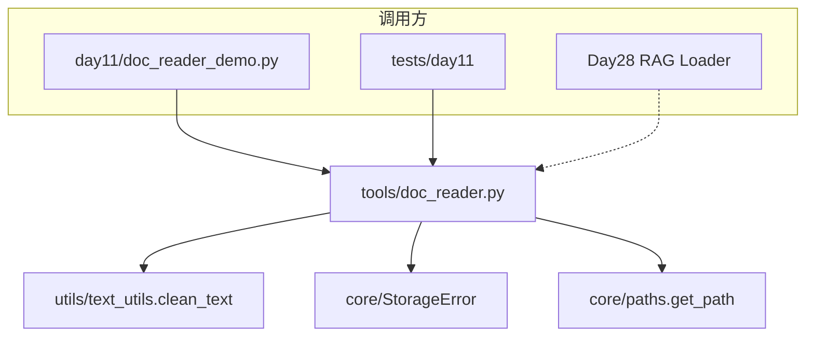

# Day 11 课堂笔记（下午）— doc_reader API 与批量清洗

**主题**：`DocumentRecord`、`batch_clean_directory`、编码回退  
**代码**：`nexus-agent-platform/src/tools/doc_reader.py`

---

## 第六节：tools 包首个生产模块（14:00 - 14:30）

Day 10 创建了空的 `tools/` 占位包；今日落地第一个模块 `doc_reader.py`。



**依赖规则**：`tools` 可 import `utils`、`core`；**禁止** import `dayXX`（与 PACKAGE_STRUCTURE 一致）。

---

## 第七节：DocumentRecord 数据类（14:30 - 15:00）

```python
@dataclass
class DocumentRecord:
    path: Path
    content: str           # 原始解码文本
    encoding: str          # 实际使用的编码
    size_bytes: int
    cleaned: str | None = None
    stats: dict = field(default_factory=dict)

    @property
    def name(self) -> str:
        return self.path.name
```

### 字段含义（面试常问）

| 字段 | 何时填充 | 示例 |
|------|----------|------|
| content | 始终 | 含「内部资料」的原文 |
| encoding | 始终 | `"gbk"` 或 `"utf-8"` |
| cleaned | `clean=True` | 敏感词已替换 |
| stats | `clean=True` | `replace_count`, `phone_masked` |

为何不用 `BaseModel`？—— 管道中间态，只读不写 JSON，无需 `from_dict` 校验。

---

## 第八节：API 分层走查（15:00 - 16:00）

### 8.1 底层：read_text_file

```python
content, encoding = read_text_file(path)
# 内部：read_bytes → 按 DEFAULT_ENCODINGS 依次 decode
# 失败：StorageError("无法用 ... 解码文件", path=...)
```

默认编码链：`utf-8` → `gbk` → `gb2312` → `latin-1`（见 `encoding_demos.py`）。

### 8.2 遍历：iter_text_files

```python
for file_path in iter_text_files(directory, "*.txt", recursive=False):
    ...
```

- `sorted(directory.glob(pattern))` 保证文件名顺序稳定（测试依赖）
- `recursive=True` 时 pattern 变为 `**/*.txt`
- 目录不存在 → `StorageError`

### 8.3 单文档：read_document

```python
record = read_document(
    path,
    clean=True,
    to_lower=False,
    mask_phone=True,
)
```

清洗流程：`clean_text` → 可选 `mask_phone_numbers`（正则 `1\d{10}`）。

### 8.4 批量：read_documents

```python
docs = read_documents(get_path("sample_docs"), clean=False)
assert len(docs) >= 3
```

### 8.5 写出：write_cleaned_documents

```python
paths = write_cleaned_documents(records, output_dir, prefix="cleaned_")
```

未清洗记录调用会抛 `StorageError`（`record.cleaned is None`）。

### 8.6 一条龙：batch_clean_directory

```python
records = batch_clean_directory(input_dir, output_dir, mask_phone=True)
```

等价于：`read_documents(clean=True)` + `write_cleaned_documents`。  
**这是 Day 3 `platform_cli` 菜单 3 的生产替代实现。**

---

## 第九节：下午实操（16:00 - 17:00）

### Lab 顺序

```bash
python3 src/day11/glob_demos.py      # iter_text_files
python3 src/day11/encoding_demos.py  # 编码回退
python3 src/day11/doc_reader_demo.py # 完整流水线
python3 -m pytest tests/day11/ -v    # 12 项测试
```

### doc_reader_demo 输出解读

```
✅ product_intro.txt
   编码 utf-8 | 压缩率 12.3%
   敏感词 2 | 手机 1
```

- `压缩率` = `(raw_len - clean_len) / raw_len`
- `phone_masked` 来自 `mask_phone_numbers` 计数

输出目录：`get_path("doc_output")` → `src/day11/output/`。

---

## 第十节：异常与测试（17:00 - 17:30）

```python
from core.exceptions import StorageError

try:
    read_text_file(Path("missing.txt"))
except StorageError as e:
    print(e.code)   # STORAGE_ERROR
    print(e.path)   # 完整路径字符串
```

| 测试函数 | 验证点 |
|----------|--------|
| test_read_text_file_gbk_fallback | GBK 文件用 gbk 解码 |
| test_mask_phone_numbers | 两个手机号 → count=2 |
| test_batch_clean_directory | 生成 cleaned_a.txt |

---

## 下午小结

| API | 一句话 |
|-----|--------|
| read_text_file | 单文件 + 编码回退 |
| iter_text_files | 有序 glob |
| read_document | 单文档 + 可选清洗 |
| read_documents | 批量读 |
| write_cleaned_documents | 写 UTF-8 清洗结果 |
| batch_clean_directory | 读洗写一条龙 |

**明天 Day 12**：`llm/client.py` 首次 HTTP 调用大模型 API；清洗后的文档文本将成为未来 Prompt 素材。

---

*作业：[08_作业.md](08_作业.md)*
