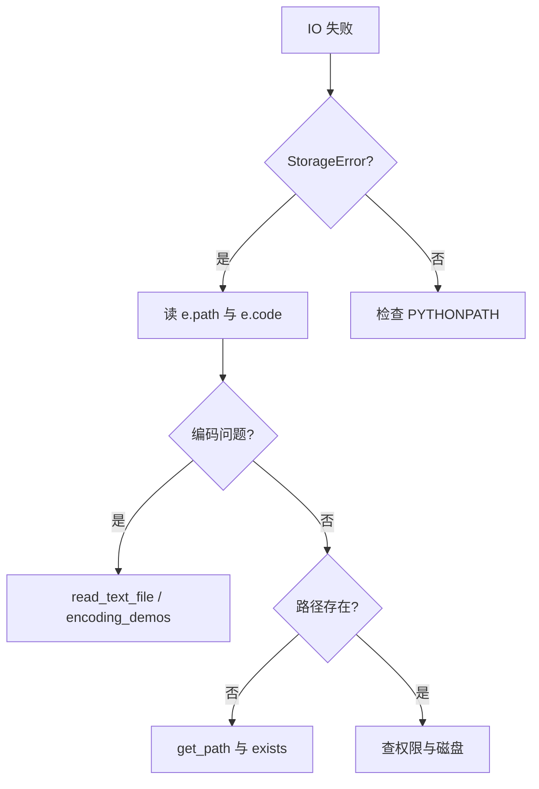

# Day 11 常见问题与排错指南

---

## Q1：UnicodeDecodeError: 'utf-8' codec can't decode byte

**现象**：直接用 `path.read_text()` 读 GBK 文件。

**原因**：`read_text(encoding="utf-8")` 不会自动回退。

**解决**：使用 `read_text_file(path)`，或手动 `read_bytes` + 编码链。参考 `encoding_demos.py`。

```python
# ❌
raw = path.read_text(encoding="utf-8")

# ✅
content, enc = read_text_file(path)
```

---

## Q2：StorageError: 文件不存在 / 目录不存在

**现象**：`read_text_file` 或 `iter_text_files` 抛 `StorageError`，`e.code == "STORAGE_ERROR"`。

**排查清单**：

1. 路径是否用了 `get_path("sample_docs")` 而非相对路径  
2. 当前工作目录是否在 `nexus-agent-platform` 根  
3. `PYTHONPATH` 是否含 `src`  

```bash
python3 -c "from core.paths import get_path; print(get_path('sample_docs'), get_path('sample_docs').exists())"
```

---

## Q3：StorageError: 文档未清洗，无法写入

**现象**：`write_cleaned_documents` 失败。

**原因**：`read_document(..., clean=False)` 时 `record.cleaned is None`。

**解决**：

```python
record = read_document(path, clean=True)
write_cleaned_documents([record], out_dir)
```

或使用 `batch_clean_directory` 一步到位。

---

## Q4：StorageError: 无法用 ('utf-8', 'gbk', ...) 解码文件

**现象**：文件为二进制或非文本（如误把 `.pdf` 改成 `.txt`）。

**解决**：

1. 用 `file` 命令或十六进制查看文件头  
2. 扩展 `encodings` 参数（作业级）；生产环境记录日志并跳过（Day 28）  
3. 不要对损坏文件强行 `latin-1` 入库 without 审计  

---

## Q5：glob 找不到文件

| 情况 | 处理 |
|------|------|
| pattern 写错 | 默认 `*.txt`，注意大小写 |
| 文件在子目录 | 设 `recursive=True` |
| 目录为空 | 非错误，返回空列表 |

```python
files = list(iter_text_files(directory, "*.txt", recursive=True))
```

---

## Q6：路径混用 str 与 Path

**现象**：类型检查告警或 `/` 运算符报错。

```python
# ❌
path = "day11/output" / "a.txt"

# ✅
path = Path("day11/output") / "a.txt"
# 或
path = get_path("doc_output") / "a.txt"
```

`StorageError` 的 `path` 字段统一 `str(path)` 存储。

---

## Q7：pytest ModuleNotFoundError: tools

```bash
cd nexus-agent-platform
export PYTHONPATH=src
python3 -m pytest tests/day11/ -v
```

测试文件已插入 `sys.path`，若仍失败检查是否在错误目录执行。

---

## Q8：doc_reader_demo 输出「未找到可处理文件」

1. 确认 `src/day02/sample_docs/*.txt` 存在  
2. 确认 `get_path("sample_docs")` 指向该目录  
3. 检查文件扩展名是否为 `.txt`  

---

## Q9：清洗后手机号仍在

**原因**：未传 `mask_phone=True`，或号码不符合 `1\d{10}`（含分隔符的号码需 Day 28 增强）。

```python
read_document(path, clean=True, mask_phone=True)
```

---

## Q10：PermissionError / OSError 与 StorageError 关系

`doc_reader` 将 `OSError` 包装为 `StorageError` 并保留 `__cause__`：

```python
except StorageError as e:
    print(e.__cause__)  # 原始 OSError
```

企业代码**不要**裸捕 `OSError` 后 silent pass。

---

## 排错流程图



---

*求助时请附带：`python3 -m pytest tests/day11/ -v` 完整输出 + 相关路径 `exists()` 结果。*
