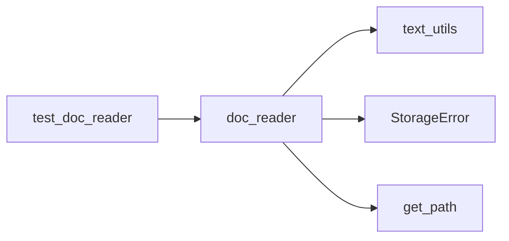

# Day 11 文件 IO 与 doc_reader 详解

**篇幅**：深度专题 · 约 4000 字  
**代码锚点**：`nexus-agent-platform/src/tools/doc_reader.py`

---

## 一、文件 IO 在 NexusAgent 中的战略位置

智链科技的知识库项目（赵岩工单）表面需求是「批量清洗 OCR 文本」，实质是构建 **可复用的文档摄取层（Ingestion Layer）**。在完整 RAG 流水线中：

```
磁盘文件 → doc_reader → clean_text → 分块 → 向量化 → 检索
```

Day 11 覆盖第一段。若此层不稳定——路径错乱、编码乱码、异常吞没——后续向量库将 garbage in, garbage out。

陈默在架构评审中明确三条红线：

1. **路径集中注册**：仅通过 `core/paths.get_path`  
2. **异常统一**：IO 失败必须是 `StorageError`，带 `path` 上下文  
3. **生产模块不进 dayXX**：`tools/doc_reader.py` 可被 Day 28 直接 import  

---

## 二、pathlib 作为唯一路径抽象

### 2.1 为何全面拥抱 Path

| 维度 | `os.path` + `open` | `pathlib.Path` |
|------|-------------------|----------------|
| 拼接 | `os.path.join(a,b)` | `a / b` |
| 存在性 | `os.path.exists(p)` | `p.exists()` |
| 读写 | 手动 `with open` | `read_text` / `write_text` |
| 类型 | `str` | `Path`（可注解） |

`doc_reader` 全模块函数签名使用 `path: Path`，迫使调用方在边界完成路径解析，避免函数内部出现 `Path(x)` 的隐式转换散落各处。

### 2.2 关键 IO 原语映射

```python
# 读全文（已知编码）
text = path.read_text(encoding="utf-8")

# 读二进制（编码未知 — doc_reader 策略）
raw = path.read_bytes()

# 写 UTF-8 清洗结果
out_path.write_text(cleaned, encoding="utf-8")

# 元数据
size = path.stat().st_size
```

`read_text_file` **故意不**调用 `read_text`，而是 `read_bytes` + 循环 `decode`，因为 `read_text` 只接受单一编码，无法表达企业「回退链」语义。

---

## 三、编码回退链的设计 rationale

### 3.1 DEFAULT_ENCODINGS 顺序

```python
DEFAULT_ENCODINGS = ("utf-8", "gbk", "gb2312", "latin-1")
```

| 编码 | 场景 |
|------|------|
| utf-8 | 现代系统、Git、API 默认 |
| gbk | 国内 Windows Excel 导出、老 OA |
| gb2312 | gbk 子集，部分 legacy 文件 |
| latin-1 | 永不失败（字节→码点一一对应），最后兜底 |

**不引入 chardet**：MVP 阶段减少依赖、行为可预测；误判成本由产品接受。Day 28 可对 >1MB 文件做采样检测。

### 3.2 失败语义

全部 `UnicodeDecodeError` 后：

```python
raise StorageError(
    f"无法用 {encodings} 解码文件",
    path=str(path),
) from last_error
```

`from last_error` 保留最后一次解码异常，符合 Day 10 异常链规范。运维可根据 `path` 字段定位共享盘上的具体文件。

---

## 四、遍历层：iter_text_files

```python
glob_pattern = f"**/{pattern}" if recursive else pattern
yield from sorted(directory.glob(glob_pattern))
```

**sorted**：保证 `a.txt` 始终在 `b.txt` 前，测试与 diff 可重复。  
**StorageError 前置校验**：目录不存在时立即失败，而非返回空迭代器（与「静默成功」区分）。

与 `day03/platform_cli.py` 对比：

```python
# Day 3
txt_files = sorted(sample_dir.glob("*.txt"))

# Day 11
for p in iter_text_files(sample_dir):
    ...
```

逻辑等价，但 Day 11 封装了存在性检查与 recursive 开关，供 RAG 加载器复用。

---

## 五、DocumentRecord：管道中的「运单」

把每份文档想象成物流运单：

| 字段 | 物流类比 |
|------|----------|
| path | 发货地址 |
| content | 原始货物 |
| encoding | 包装规格 |
| size_bytes | 重量 |
| cleaned | 质检后货物 |
| stats | 质检报告 |

`@dataclass` 选择理由：

- 只承载数据，无业务校验逻辑  
- `field(default_factory=dict)` 避免可变默认陷阱  
- `name` 属性封装 `path.name`，模板渲染方便  

---

## 六、清洗集成与脱敏

### 6.1 clean_text 管道

```python
cleaned, stats = clean_text(content, to_lower=to_lower)
```

`utils/text_utils.py` 步骤：按行 strip → 合并空白 → 合并重复标点 → 敏感词替换 → 可选小写。

`stats` 键：`raw_len`, `clean_len`, `replace_count`, `empty_dropped`, `raw_lines`, `clean_lines`。

### 6.2 mask_phone_numbers

```python
_PHONE_PATTERN = re.compile(r"1\d{10}")
```

在 `clean=True` 之后执行，避免清洗前号码格式干扰。计数写入 `stats["phone_masked"]`，供 `doc_reader_demo.py` 打印。

---

## 七、批量写出：write_cleaned_documents

```python
output_dir.mkdir(parents=True, exist_ok=True)
out_path = output_dir / f"{prefix}{record.name}"
out_path.write_text(record.cleaned, encoding="utf-8")
```

**输出统一 UTF-8**：下游 RAG、LLM API 均假设 UTF-8。  
**前缀 `cleaned_`**：与 Day 3 输出命名一致，便于回归对比。

---

## 八、batch_clean_directory：生产入口

```python
def batch_clean_directory(input_dir, output_dir, *, pattern="*.txt", ...):
    records = read_documents(input_dir, pattern, clean=True, ...)
    write_cleaned_documents(records, output_dir)
    return records
```

`doc_reader_demo.py` 仅负责打印统计，业务逻辑零分叉。这是 **工具模块 + 薄 CLI** 的企业模式。

---

## 九、依赖与测试矩阵



12 个测试覆盖：UTF-8、GBK 回退、缺失文件、排序 glob、脱敏、清洗统计、批量写出、batch_clean。

---

## 十、与后续课程衔接

| 天数 | 如何使用 doc_reader |
|------|---------------------|
| Day 12-14 | 清洗文本作 LLM 上下文样例 |
| Day 28 | `DocumentLoader` 封装 `read_documents` |
| Day 32+ | 分块前统一编码与脱敏 |

---

## 十一、自查问题

1. 为何 `read_text_file` 用 bytes 而非 `read_text`？  
2. `write_cleaned_documents` 何时抛 `StorageError`？  
3. `recursive=False` 时子目录文件是否被读取？  
4. `get_path("doc_output")` 在 `paths.py` 哪一行注册？  

答案分别见本文第二、七、四节与 `core/paths.py` 第 28 行。

---

*配合 [20_完整代码走查.md](20_完整代码走查.md) 与 [25_doc_reader精读.md](25_doc_reader精读.md) 阅读源码。*
