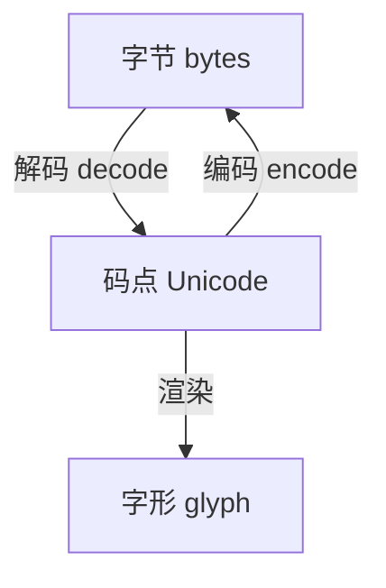

# Day 11 深度扩展：正则与编码

**专题**：手机号正则 `1\d{10}` · 字符编码理论 · 企业实践

---

## 一、正则脱敏在企业文档中的位置

### 1.1 为何 Day 11 才正式启用手机号规则

Day 2 `text_cleaner` 样本中已有简单手机脱敏概念，但逻辑留在教学 CLI。ZL-NA-REQ-011 要求在 **生产管道** 中可开关：

```python
read_document(path, clean=True, mask_phone=True)
```

### 1.2 模式剖析

```python
_PHONE_PATTERN = re.compile(r"1\d{10}")
```

| 部分 | 含义 |
|------|------|
| `1` | 大陆手机号首位 |
| `\d{10}` | 后续 10 位数字 |
| 合计 | 11 位连续数字 |

**已知局限**（产品文档需注明）：

- 不匹配 `138-1234-5678`（带分隔符）  
- 不匹配 `+86 138...`（国际区号）  
- 可能误伤 11 位产品编号（需上下文 NLP，Day 32+）  

### 1.3 替换函数与计数

```python
def _repl(match: re.Match[str]) -> str:
    nonlocal count
    count += 1
    return "***PHONE***"

masked = _PHONE_PATTERN.sub(_repl, text)
```

使用回调而非 `sub("***PHONE***", text)` 是为了统计 `phone_masked` 次数，写入 `DocumentRecord.stats`。

### 1.4 扩展思考

**作业**：如何改写正则支持可选连字符 `1\d{2}[-\s]?\d{4}[-\s]?\d{4}`？讨论贪婪匹配与性能。

---

## 二、字符编码理论基础

### 2.1 三个层次



- **bytes**：磁盘上的原始 0-255 序列  
- **Unicode**：抽象字符编号（如「智」U+667A）  
- **encoding**：bytes ↔ Unicode 的规则（UTF-8、GBK）  

Python 3 中 `str` 是 Unicode，`bytes` 是原始字节；**永远不要混用**。

### 2.2 UTF-8 特性

- 变长：英文 1 字节，常用中文 3 字节  
- 自同步：错位解码易触发 `UnicodeDecodeError`  
- Web 与 Git 事实标准  

### 2.3 GBK 与 gb2312

- **gb2312**：约 6763 汉字，双字节  
- **gbk**：gb2312 超集，含更多汉字与符号  
- 企业老文档：Excel「CSV ANSI」在中文 Windows 常为 GBK  

**回退顺序**先 gbk 再 gb2312：gbk 解码 gb2312 文件通常成功；反之不一定。

### 2.4 latin-1 兜底的双刃剑

`latin-1`（ISO-8859-1）将每个字节映射到 U+0000–U+00FF，**永不抛 UnicodeDecodeError**。

含义：若前三种编码都「碰巧」解码出乱码而非报错，latin-1 仍会返回——因此生产环境应对 latin-1 结果做启发式质检（可读字符比例），Day 28 实现。

---

## 三、encode / decode API

```python
text = "智链"
utf8_bytes = text.encode("utf-8")      # b'\xe6\x99\xba\xe9\x93\xbe'
roundtrip = utf8_bytes.decode("utf-8") # "智链"

# 错误处理策略（了解）
text.encode("ascii", errors="ignore")   # 丢弃无法编码字符
text.encode("ascii", errors="replace") # 用 ? 替换
```

`read_text_file` 使用严格 `decode`（默认 `strict`），失败则尝试下一编码。

---

## 四、文件系统与编码无关的路径

**重要**：`Path` 路径名在 Linux 上是 bytes（可含非 UTF-8）；**文件内容编码**与路径无关。

```python
# 路径合法 ≠ 内容 UTF-8
weird = Path("/tmp/中文目录/文件.txt")
weird.write_bytes("非utf8".encode("gbk"))
```

---

## 五、BOM 与 UTF-8-sig

部分 Windows 编辑器写入 UTF-8 BOM（`EF BB BF`）。`utf-8` 解码通常成功但首字符可能含 `\ufeff`。

Day 11 未处理 BOM；Day 28 可在 `clean_text` 前 `text.lstrip("\ufeff")`。

---

## 六、企业规范建议

| 规范 | 说明 |
|------|------|
| 内部交换 | UTF-8 无 BOM |
| 对外导出 | 显式注明 encoding |
| 日志 | 记录 `DocumentRecord.encoding` |
| 错误 | StorageError + path，禁止 print 吞异常 |

---

## 七、实验清单

```bash
python3 src/day11/encoding_demos.py
python3 -c "
from pathlib import Path
p = Path('/tmp/enc_test.txt')
p.write_bytes('测试'.encode('gbk'))
from tools.doc_reader import read_text_file
print(read_text_file(p))
"
```

---

*延伸阅读：[23_编码与文件系统实践.md](23_编码与文件系统实践.md)、[19_讲师补充阅读.md](19_讲师补充阅读.md)*
