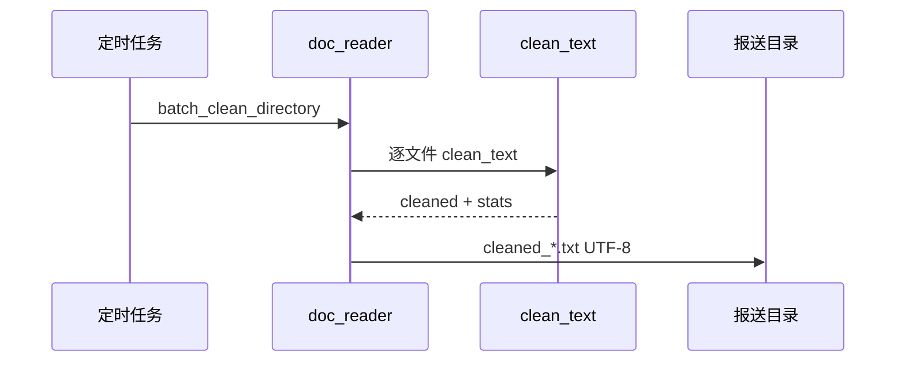

# Day 11 企业案例集：文档流水线

**场景**：智链科技金融业务部真实工单抽象  
**技术栈**：pathlib · doc_reader · clean_text · StorageError

---

## 案例一：OCR 扫描件批量入库（赵岩工单）

### 背景

300 份理财产品说明书 OCR 输出为 `.txt`，存放共享盘 `//nas/finance/ocr_202607/`。编码混杂：新扫描 UTF-8，老扫描 GBK。

### 方案

```python
from pathlib import Path
from tools.doc_reader import batch_clean_directory

input_dir = Path("/mnt/nas/finance/ocr_202607")
output_dir = Path("/mnt/nas/finance/ocr_cleaned")
records = batch_clean_directory(input_dir, output_dir, mask_phone=True)

for r in records:
    if r.stats.get("phone_masked", 0) > 0:
        audit_log(r.path, r.stats)  # 合规审计
```

### 要点

- 编码回退避免人工转码  
- `phone_masked` 统计满足合规脱敏报告  
- 失败文件 `StorageError.path` 写入运维 ticket  

---

## 案例二：日终监管报送文本清洗

### 背景

每日 17:00 生成 50+ 报送草稿，含敏感词「内部资料」「机密」。需在入库前统一清洗，输出 UTF-8 供下游 XML 封装。

### 数据流



### KPI

| 指标 | 目标 |
|------|------|
| 处理成功率 | ≥ 99% |
| 单文件耗时 | < 200ms（<100KB） |
| 编码未知 | 0（全部记录 encoding 字段） |

---

## 案例三：客服知识库冷启动

### 背景

产品 FAQ 从历史 Word 另存为 txt，放入 `sample_docs` 同类目录。RAG 项目（Day 28）要求 **与 demo 相同 API**。

### 实现

```python
from core.paths import get_path
from tools.doc_reader import read_documents

# 路径注册后
docs = read_documents(get_path("sample_docs"), clean=True, mask_phone=False)
chunks = [d.cleaned for d in docs if d.cleaned]
```

**架构收益**：FAQ 导入与 OCR 清洗共用 `tools` 层，CLI 仅作演示。

---

## 案例四：失败隔离与部分成功

### 背景

某批次 100 文件中 2 个损坏二进制。业务要求：其余 98 个继续处理。

### Day 11 MVP vs 生产演进

| 阶段 | 行为 |
|------|------|
| Day 11 | 遇错即抛，整批 pytest 红 |
| Day 28 | 包装为 `read_documents_safe`，单文件 try/except 记录 skip |

```python
# 演进草图（非当日代码）
def read_documents_safe(directory, ...):
    records, errors = [], []
    for path in iter_text_files(directory):
        try:
            records.append(read_document(path, ...))
        except StorageError as e:
            errors.append(e)
    return records, errors
```

---

## 案例五：与 Day 3 教学 CLI 的并行期

### 背景

培训期间新老学员并存：有人只学过 `platform_cli` 菜单 3。

### 对照

| 维度 | Day 3 | Day 11 生产 |
|------|-------|-------------|
| 入口 | 交互菜单 | Python API / 薄脚本 |
| 清洗模块 | importlib 加载 day02 | import utils.text_utils |
| 输出路径 | day03/output | day11/output（可配置） |
| 测试 | 菜单集成测试 | 12 单元测试 |

**迁移建议**：新脚本统一 `doc_reader_demo.py`；旧 CLI 保留至 Sprint 2 结束。

---

## 案例六：多租户路径隔离

### 背景

SaaS 化后每租户独立目录 `data/tenant_{id}/docs`。

### paths.py 扩展模式

```python
def get_tenant_docs(tenant_id: str) -> Path:
    return DATA_ROOT / "tenants" / tenant_id / "docs"
```

不在 `PATHS` 硬编码租户 ID；动态路径由服务层传入 `batch_clean_directory`。

---

## 案例七：审计与 stats 字段

`DocumentRecord.stats` 企业用法：

```json
{
  "raw_len": 2048,
  "clean_len": 1820,
  "replace_count": 3,
  "phone_masked": 1,
  "empty_dropped": 5
}
```

写入 ELK（Day 46）后可做：

- 敏感词命中率趋势  
- 异常压缩率（可能 OCR 乱码）  

---

## 案例八：合规留存原始文件

**原则**：`write_cleaned_documents` 只写清洗版；原始文件只读不改。  
法务要求保留 OCR 原稿 5 年——`doc_reader` 符合只读 ingest 模式。

---

## 总结对照表

| 案例 | 核心 API | 风险点 |
|------|----------|--------|
| OCR 批量 | batch_clean_directory | 编码 |
| 监管报送 | mask_phone + stats | 脱敏遗漏 |
| FAQ 入库 | read_documents(clean=True) | 路径注册 |
| 部分失败 | 演进 safe 版本 | 静默丢文件 |
| 多租户 | 动态 Path | 路径注入 |

---

*对照 [18_与Day3批处理对照表.md](18_与Day3批处理对照表.md) 与 [14_企业案例集](14_企业案例集_文档流水线.md) 架构图。*
