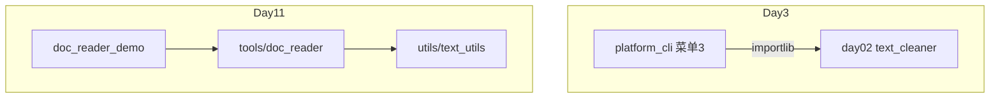

# Day 11 与 Day 3 批处理对照表

**目的**：说明 `tools/doc_reader.py` 如何替代 `day03/platform_cli.py` 菜单 3

---

## 总览

| 维度 | Day 3 `platform_cli` | Day 11 `doc_reader` |
|------|---------------------|---------------------|
| 代码位置 | `src/day03/platform_cli.py` | `src/tools/doc_reader.py` |
| 性质 | 教学 CLI | 生产工具模块 |
| 需求 | 教学迭代 | ZL-NA-REQ-011 |
| 入口 | 交互菜单「3」 | Python API + `doc_reader_demo.py` |
| 清洗实现 | `importlib` 动态加载 day02 | `from utils.text_utils import clean_text` |
| 路径 | `constants` / 相对路径拼接 | `get_path("sample_docs")` |
| 输出目录 | `day03/output` | `get_path("doc_output")` → day11/output |
| 输出命名 | `cleaned_{原名}` | 同：`prefix="cleaned_"` |
| 编码 | `read_text(encoding="utf-8")` 固定 | 编码回退链 |
| 手机脱敏 | day02 `clean_text(mask_phone=...)` | `mask_phone_numbers` 正则 |
| 异常 | print + return | `StorageError` + path |
| 测试 | 菜单集成测试 | 12 单元测试 |

---

## 代码对照

### 遍历文件

**Day 3** (`handle_batch_clean`):

```python
txt_files = sorted(sample_dir.glob("*.txt"))
for path in txt_files:
    ...
```

**Day 11**:

```python
for file_path in iter_text_files(directory, pattern="*.txt"):
    ...
```

等价点：`sorted` + `*.txt`。Day 11 额外校验目录存在。

---

### 读取与清洗

**Day 3**:

```python
raw = path.read_text(encoding="utf-8")
cleaned, stats = cleaner.clean_text(raw)
```

**Day 11**:

```python
record = read_document(path, clean=True, mask_phone=True)
# 内部: read_text_file → clean_text → mask_phone_numbers
```

---

### 写出

**Day 3**:

```python
out_path = output_dir / f"cleaned_{path.name}"
out_path.write_text(cleaned, encoding="utf-8")
```

**Day 11**:

```python
write_cleaned_documents(records, output_dir)  # 默认 prefix="cleaned_"
```

---

## 架构层次对照



---

## 行为差异清单

| 场景 | Day 3 | Day 11 |
|------|-------|--------|
| GBK 文件 | 可能 UnicodeDecodeError | gbk 回退成功 |
| 缺目录 | print 警告 | StorageError |
| 未清洗写出 | 不适用 | StorageError |
| 返回值 | 无（副作用打印） | `list[DocumentRecord]` |
| RAG 复用 | 需复制逻辑 | `import tools.doc_reader` |

---

## 迁移检查表

- [ ] 新脚本改用 `batch_clean_directory`  
- [ ] 路径改用 `get_path`  
- [ ] 异常改捕 `StorageError`  
- [ ] 输出对比 `diff day03/output day11/output`  
- [ ] pytest day11 全绿  

---

## 何时仍参考 Day 3

- 学习 `importlib` 动态加载（Day 10 已弱化）  
- 理解菜单驱动 CLI 模式（Day 14 `cli_assistant` 仍用类似结构）  
- 历史 commit 考古  

---

*案例：[14_企业案例集_文档流水线.md](14_企业案例集_文档流水线.md)*
