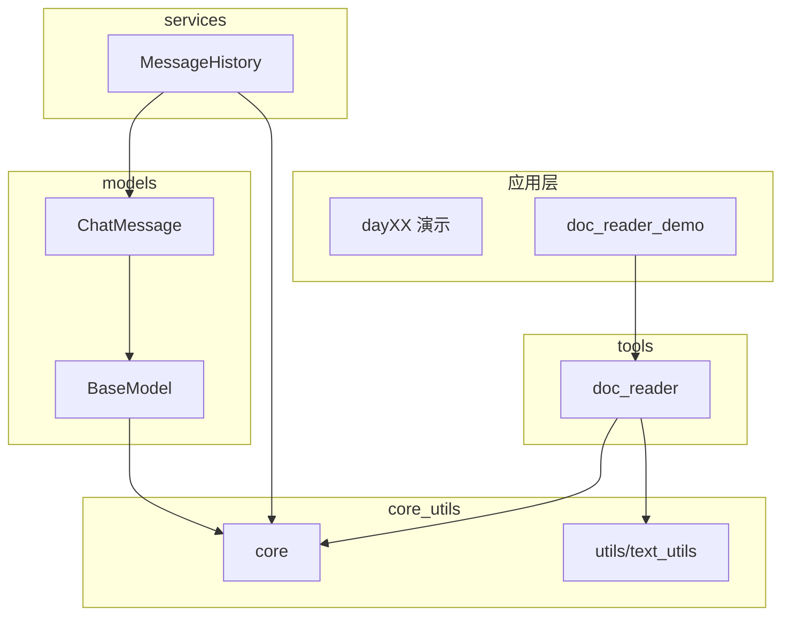

# Day 11 Sprint 2 阶段回顾（Day 8-11）

Sprint 2 前四天完成 OOP 深化、包结构重组与首个 tools 生产模块。本文串联四日产出，约 4000 字。

---

## Sprint 2 总目标

> 将 NexusAgent 从「教学脚本集合」升级为「可分层扩展的企业代码库」，并为对话能力与 RAG 铺路。

| 天数 | 主题 | 关键词 |
|------|------|--------|
| Day 8 | OOP 上 | ChatMessage, MessageHistory |
| Day 9 | OOP 下 | BaseModel, ModelConfig |
| Day 10 | 模块与异常 | core/services, NexusError |
| Day 11 | 文件与标准库 | doc_reader, pathlib |

---

## Day 8：ChatMessage 类

**核心**：从 dict 升级到 class，数据与行为封装。

| 产出 | 路径 |
|------|------|
| ChatMessage | models/message.py |
| MessageHistory | day08 → 后迁 services |
| message_cli | day08 |

**关键方法**：`validate`, `to_dict`, `from_dict`, `to_api_message`

**企业意义**：为 Day 12 LLM API 消息格式对齐 OpenAI schema。

---

## Day 9：BaseModel 抽象体系

**核心**：为所有模型立法，抽象方法强制实现。

| 产出 | 路径 |
|------|------|
| BaseModel | models/llm_base.py |
| ModelConfig | models/model_config.py |
| Contact | models/contact.py |

**关键方法**：`ensure_valid`, `from_dict_safe`, `is_valid`

**企业意义**：统一校验入口，减少「脏数据」进入服务层。

---

## Day 10：包结构重组

**核心**：分层目录 + 统一异常 + 服务层。

| 产出 | 路径 |
|------|------|
| NexusError 体系 | core/exceptions.py |
| 路径注册 | core/paths.py |
| bootstrap | core/bootstrap.py |
| MessageHistoryService | services/ |
| 骨架包 | llm, chat, tools |

**关键 API**：`get_path`, `StorageError`, `setup_python_path`

**企业意义**：依赖方向可审计，`structure_audit.py` 作 CI 门禁。

---

## Day 11：doc_reader 文档流水线

**核心**：pathlib + 编码回退 + 批量清洗，tools 首个实模块。

| 产出 | 路径 |
|------|------|
| doc_reader | tools/doc_reader.py |
| DocumentRecord | 同上 |
| 路径键 | sample_docs, doc_output |
| 演示 | day11/*_demos.py |
| 测试 | tests/day11/ (12 用例) |

**关键 API**：`read_text_file`, `batch_clean_directory`, `iter_text_files`

**企业意义**：替代 Day 3 批处理；Day 28 RAG ingest 直接复用。

---

## 四日后架构图

---

## 代码量与测试（约）

| Day | 新增测试约 | 累计 pytest |
|-----|------------|-------------|
| 8 | 13 | 87 |
| 9 | 11 | 98 |
| 10 | 10 | 108 |
| 11 | 12 | 120 |

---

## 能力矩阵

| 能力 | D8 | D9 | D10 | D11 |
|------|----|----|-----|-----|
| 类与对象 | ✓ | ✓ | | |
| 抽象类 | | ✓ | | |
| 包/import | | | ✓ | ✓ |
| 自定义异常 | | | ✓ | ✓ |
| pathlib | | | | ✓ |
| 批量文件 IO | | | | ✓ |
| 生产 tools | | | 占位 | ✓ |

---

## 常见面试题串联

1. dict 和 class 区别？— Day 8  
2. 抽象类作用？— Day 9  
3. 如何组织 Python 项目目录？— Day 10  
4. 自定义异常为何分层？— Day 10  
5. 如何处理 GBK 文件？— Day 11  
6. tools 与 dayXX 边界？— Day 11  

---

## Day 11 当日自查清单

- [ ] 能默写 `DEFAULT_ENCODINGS` 顺序  
- [ ] 能解释 `DocumentRecord` 各字段  
- [ ] 能运行 `doc_reader_demo.py` 并解读压缩率  
- [ ] 能说出 `batch_clean` 与 Day 3 菜单 3 的三点差异  
- [ ] `pytest tests/day11/` 全绿  

---

## 明日 Day 12 预告

**首次 LLM API 调用**：`llm/client.py`、环境变量 API Key、HTTP 请求。  
清洗后的 `cleaned_*.txt` 将作为 few-shot 或知识片段样本。

---

## Sprint 2 剩余路线（预览）

| 天 | 主题 |
|----|------|
| Day 12 | llm/client |
| Day 13 | Prompt 基础 |
| Day 14 | cli_assistant 整合 |

---

*Day 10 回顾见 `course/day10/24_Sprint2阶段回顾.md`；本文件在其基础上延伸至 Day 11。*
