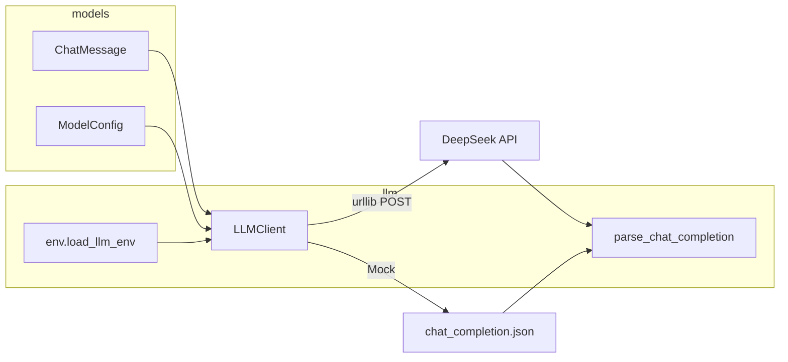

# Day 12 旁白解读：从离线 JSON 到真实 HTTP

> **前置要求**：完成 Day 1-11，尤其 Day 5 `api_response_parser` 与 Day 8-9 `ChatMessage` / `ModelConfig`

---

## 旁白

2026 年 7 月 17 日。智链科技 Sprint 2 进入第五个工作日。赵岩在站会上举起手机：

> 「知识库文档昨天能批量读了，但**问答还得靠人**。陈默，今天能不能让 NexusAgent **真正开口说话**？」

陈默在白板上画了一条线：

```
Day 5  读 JSON 文件  →  解析 choices[0].message.content
Day 12 发 HTTP POST  →  同样的 JSON 从网线回来
```

林晓问：「为什么不用 `requests`？网上教程都用它。」

> 「`urllib` 是标准库，零依赖、行为稳定。企业内网镜像、CI 沙箱、嵌入式环境——**能少装一个包就少一个**。Day 13 我们会用装饰器给客户端加重试；今天先把**一次完整调用**跑通。」

周航补充 Mock 策略：

> 「`NEXUS_LLM_MOCK=1` 时读 `day05/sample_data/chat_completion.json`，和真实 API 返回格式一致。GitHub Actions 不设 Key 也能全绿。」

---

## 今日在架构中的位置



---

## 林晓的学习建议

1. 先跑 `http_demos.py`，理解 `urllib.request.Request` 与 `urlopen`
2. 再跑 `api_demos.py`，对照 OpenAI 文档看请求体字段
3. 最后 `NEXUS_LLM_MOCK=1 python3 src/day12/llm_client_demo.py`
4. 有 Key 的同学去掉 Mock，体验 Live 模式（注意费用）

**三遍原则**：读 `client.py` → 单步调试 `complete()` → 故意删掉 Key 看 `ConfigError`。

---

## 与前后日的衔接

| 方向 | 内容 |
|------|------|
| 回顾 Day 5 | `parse_chat_completion` 逻辑从教学脚本迁入 `llm/response.py` |
| 回顾 Day 11 | `doc_reader` 读出的文本，未来作为 `user` 消息上下文 |
| 预告 Day 13 | `@retry` 装饰器包装 `complete`，处理限流与网络抖动 |
| 预告 Day 14 | `cli_assistant` 交互式调用 `LLMClient.chat()` |

---

*下一篇：[01_企业背景与今日任务.md](01_企业背景与今日任务.md)*
