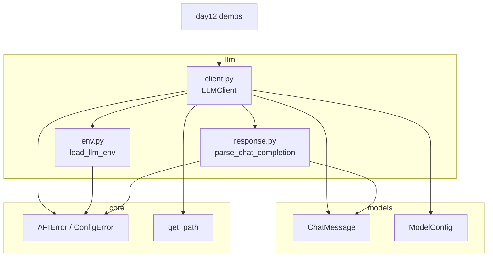
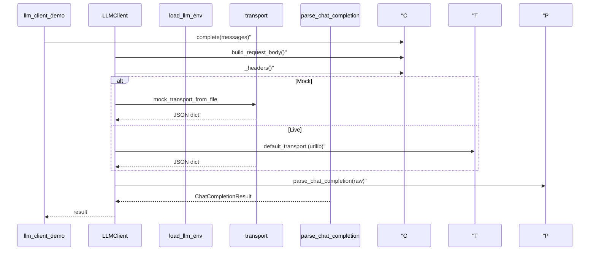

# Day 12 架构设计

## 模块图



## 分层职责

| 层 | 模块 | 职责 |
|----|------|------|
| 模型层 | `models` | 消息与配置校验、`to_api_message()` |
| 配置层 | `llm/env` | 环境变量、URL 拼接、Mock 开关 |
| 传输层 | `llm/client` | HTTP POST、transport 抽象 |
| 解析层 | `llm/response` | JSON → 领域对象 |
| 异常层 | `core/exceptions` | 统一错误码与上下文 |

## 调用序列



## LLMClient 构造决策树

```
transport 参数显式传入？
  ├─ 是 → 使用注入的 transport
  └─ 否 → env.mock？
        ├─ 是 → mock_transport_from_file(sample_path)
        └─ 否 → default_transport (urllib)
```

## 数据流

1. `ChatMessage` + `ModelConfig` → `build_request_body()` → `dict`
2. `load_llm_env()` → `LLMEnvConfig`（含 `chat_completions_url`）
3. `transport(url, headers, body)` → `raw: dict`
4. `parse_chat_completion(raw)` → `ChatCompletionResult`
5. `result.message` 为 `ChatMessage(role="assistant", ...)`

## 路径注册

`core/paths.py`：

```python
"chat_completion_sample": SRC_ROOT / "day05" / "sample_data" / "chat_completion.json"
```

Mock 与 Day 5 教学样本**同源**，保证字段一致。

## 与包结构（Day 10）的关系

```
src/
├── llm/
│   ├── __init__.py      # 导出 LLMClient
│   ├── client.py
│   ├── env.py
│   └── response.py
├── models/
│   ├── message.py
│   └── model_config.py
└── day12/               # 仅演示，非生产入口
```

生产代码调用 `from llm import LLMClient`，不 `import day12`。

## 设计原则

1. **传输与解析分离**：换厂商 API 只改 URL/Key，解析层若兼容 OpenAI 格式可复用  
2. **失败快速**：校验在边界（`ensure_valid`、缺 Key）  
3. **可测试性**：transport 注入，CI 零网络  
4. **标准库优先**：urllib + json + os.environ

---

*流程图：[04_流程图与示意图.md](04_流程图与示意图.md)*
