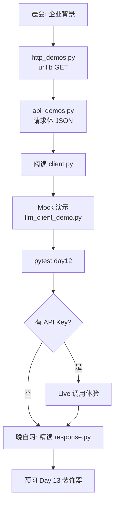
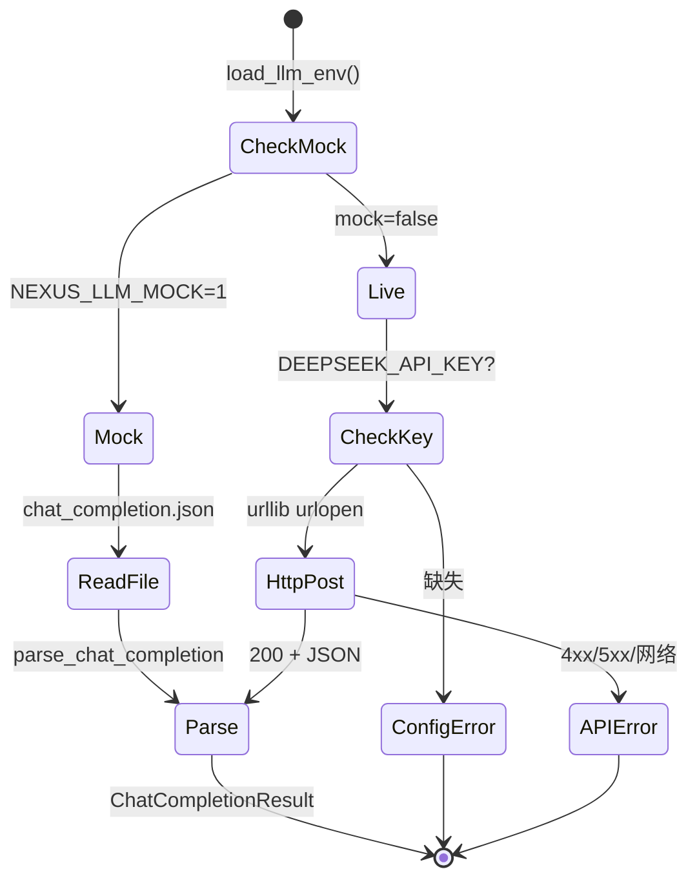
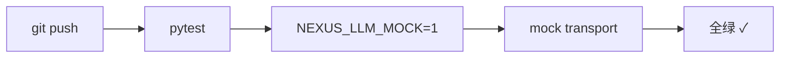

# Day 12 流程图与示意图

## 1. 学员一日学习路径



## 2. HTTP POST 数据流

```
┌─────────────┐     build_request_body      ┌──────────────┐
│ ChatMessage │ ──────────────────────────► │  JSON body   │
│ ModelConfig │                               │  (dict)      │
└─────────────┘                               └──────┬───────┘
                                                     │
┌─────────────┐     _headers()                ┌──────▼───────┐
│ LLMEnvConfig│ ──────────────────────────► │   headers    │
└─────────────┘                               └──────┬───────┘
                                                     │
                                              json.dumps + utf-8
                                                     │
                                              ┌──────▼───────┐
                                              │ urllib POST  │
                                              └──────┬───────┘
                                                     │
                                              ┌──────▼───────┐
                                              │  raw JSON    │
                                              └──────┬───────┘
                                                     │
                                              parse_chat_completion
                                                     │
                                              ┌──────▼───────┐
                                              │ChatCompletion│
                                              │   Result     │
                                              └──────────────┘
```

## 3. Mock vs Live 模式



## 4. 异常分支图

```
complete()
    │
    ├─ build_request_body
    │     └─ ValidationError (ChatMessage/ModelConfig)
    │
    ├─ _headers()
    │     └─ ConfigError (非 Mock 无 Key)
    │
    ├─ transport()
    │     ├─ HTTPError → APIError(status_code, body)
    │     ├─ URLError → APIError(网络)
    │     ├─ JSONDecodeError → APIError
    │     └─ Mock 文件不存在 → APIError
    │
    └─ parse_chat_completion()
          ├─ error 字段 → APIError
          ├─ choices 空 → APIError
          └─ content 空 → APIError
```

## 5. OpenAI 兼容消息结构

```
请求 messages[]          响应 choices[0].message
┌────────────────┐       ┌────────────────┐
│ role: system   │       │ role: assistant│
│ content: "..." │  ──►  │ content: "..." │
├────────────────┤       └────────────────┘
│ role: user     │
│ content: "..." │
└────────────────┘
```

`ChatMessage.to_api_message()` 仅导出 `role` + `content`（不含 `created_at`）。

## 6. Sprint 2 位置（Day 10-12）

```
Day 10  包重组 + 异常体系
Day 11  doc_reader 文档摄取
Day 12  llm/client API 调用  ← 今日
Day 13  装饰器 + 重试
Day 14  cli_assistant 集成
```

## 7. CI 流水线示意



无需 `DEEPSEEK_API_KEY` secret。

---

*详解：[11_HTTP与LLM客户端详解.md](11_HTTP与LLM客户端详解.md)*
