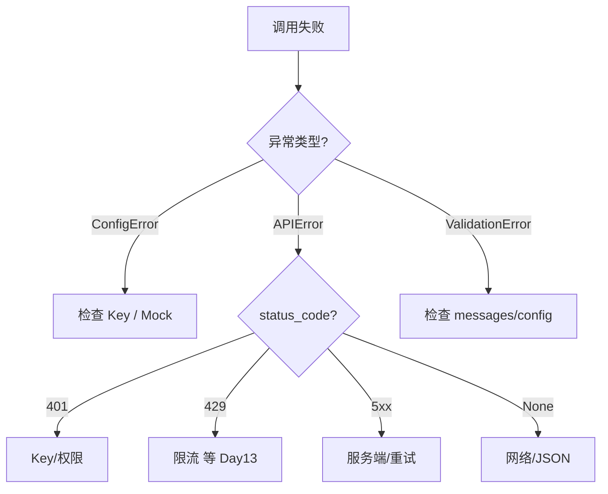

# Day 12 常见问题与排错指南

---

## 环境与配置

### Q1：`ConfigError: 缺少 DEEPSEEK_API_KEY`

**原因**：非 Mock 模式且环境变量与 `.env` 均无 Key。

**解决**：

```bash
# 方案 A：Mock（推荐课堂/CI）
export NEXUS_LLM_MOCK=1

# 方案 B：配置 Key
cp .env.example .env
# 编辑 DEEPSEEK_API_KEY=sk-...
```

---

### Q2：`.env` 改了但不生效

**原因**：`os.environ` 优先级高于 `.env`；或 shell 已 export 空值。

**排查**：

```bash
echo $DEEPSEEK_API_KEY
echo $NEXUS_LLM_MOCK
```

先 `unset DEEPSEEK_API_KEY` 再试。

---

### Q3：`ModuleNotFoundError: llm`

**解决**：

```bash
cd nexus-agent-platform
export PYTHONPATH=src
# 或
python3 -m pytest tests/day12/ -v
```

---

## Mock 模式

### Q4：Mock 报 `Mock 样本不存在`

**原因**：`chat_completion_sample` 路径错误。

**检查**：

```python
from core.paths import get_path
print(get_path("chat_completion_sample"))
# 应指向 src/day05/sample_data/chat_completion.json
```

---

### Q5：Mock 成功但 content 与预期不符

**说明**：Mock 返回**固定样本**内容，与 user 问题无关。这是预期行为——验证管道，非验证模型智能。

---

## Live 调用

### Q6：`APIError (HTTP 401)`

- Key 错误或过期
- 未走 Mock 但 Key 未加载
- 检查 `Authorization: Bearer <key>` 是否由 `_headers()` 添加

---

### Q7：`APIError (HTTP 429)`

限流。今日无重试，直接失败。**Day 13** 将用装饰器指数退避重试。

---

### Q8：网络超时

`default_transport` 使用 `timeout=60`。内网代理环境可能需要配置 `HTTP_PROXY`（urllib 支持系统代理）。

---

## 代码与测试

### Q9：`ValidationError` on ChatMessage

- `role` 必须是 system/user/assistant
- `content` 不能为空字符串

---

### Q10：pytest 个别用例需要网络？

不应需要。确认：

```bash
NEXUS_LLM_MOCK=1 pytest tests/day12/ -v
```

若失败，检查是否误删 Mock 默认或 monkeypatch。

---

### Q11：`choices` 为空

响应格式不对或 API 返回异常结构。打印 `raw`：

```python
except APIError as e:
    print(e.response_body)
```

---

## 设计选择

### Q12：为什么用 urllib 不用 requests？

标准库、零依赖、企业审批简单。见 `13_深度扩展_urllib与requests.md`。

### Q13：为何不用 python-dotenv？

Day 12 教学手写 `parse_env_file`，理解 `.env` 格式；生产可后续引入。

---

## 排错流程图



---

*深度专题：[11_HTTP与LLM客户端详解.md](11_HTTP与LLM客户端详解.md)*
