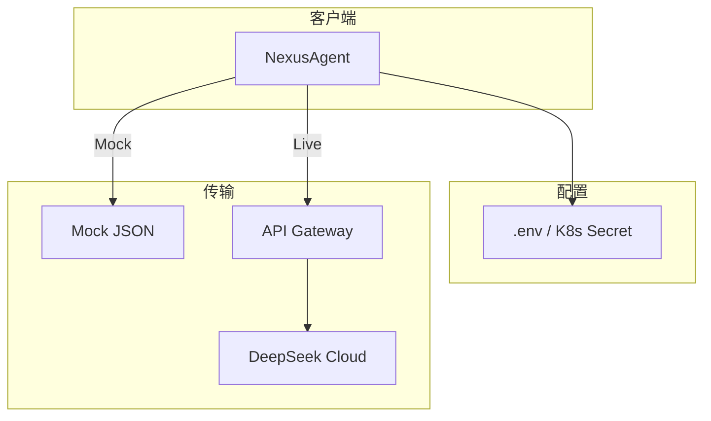

# Day 12 企业案例集：API 集成

**主题**：大模型 API 在真实企业场景中的集成模式

---

## 案例 1：智链科技知识库问答（本项目）

**场景**：理财说明书 OCR 文本（Day 11）+ 用户提问 → LLM 回答

```
doc_reader → 文本片段 → ChatMessage(user) → LLMClient → 展示
```

**要点**：

- Mock 用于开发/CI  
- Live 用于预发验证  
- `max_tokens` 控制单次成本

---

## 案例 2：多环境 Base URL

| 环境 | DEEPSEEK_BASE_URL |
|------|-------------------|
| 开发 | 官方 API |
| 预发 | 企业 API 网关（仍 OpenAI 兼容） |
| CI | Mock，无 URL |

`load_llm_env` 仅改环境变量，代码零修改。

---

## 案例 3：密钥轮转

**问题**：Key 泄露需轮换

**实践**：

1. 新 Key 写入密钥管理系统，注入 `DEEPSEEK_API_KEY`  
2. 旧 Key 作废  
3. **绝不** commit `.env`  
4. 日志脱敏：`sk-***`

---

## 案例 4：429 限流与 Day 13 重试

**现象**：促销活动期间 API 返回 429

**今日**：直接 `APIError`，用户看到失败

**Day 13**：指数退避

```
wait 1s → retry → wait 2s → retry → fail
```

---

## 案例 5：离线演示与客户 POC

**场景**：无外网会议室给客户演示

**方案**：

```bash
NEXUS_LLM_MOCK=1 python3 src/day12/llm_client_demo.py
```

可替换 `sample_path` 为定制化 JSON，模拟行业话术。

---

## 案例 6：可观测性与 token 统计

`ChatCompletionResult.usage_summary()` 对接：

- 成本核算（prompt/completion 单价不同）  
- 配额告警  
- 慢查询分析（结合 latency，Day 30）

---

## 案例 7：供应商锁定与 OpenAI 兼容

**策略**：请求体/解析层按 OpenAI 标准实现，切换厂商仅改：

- `DEEPSEEK_BASE_URL`  
- `DEEPSEEK_API_KEY`  
- `ModelConfig.model` 名称

**风险**：部分厂商扩展字段不兼容，需适配层（Day 20+）。

---

## 架构图：企业集成全景



---

## 检查清单（上线前）

- [ ] `.env` 在 `.gitignore`  
- [ ] CI 使用 `NEXUS_LLM_MOCK=1`  
- [ ] 生产 Key 来自 Secret，非明文配置  
- [ ] `APIError` 不向前端暴露 `response_body` 全文  
- [ ] `max_tokens` 有上限配置  

---

*密钥实践：[23_API密钥与环境变量实践.md](23_API密钥与环境变量实践.md)*
