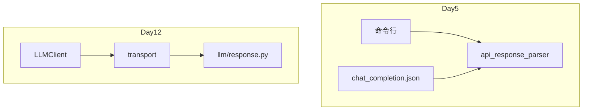

# Day 12 与 Day 5 解析器对照表

**目的**：说明 `llm/response.py` 如何承接 Day 5 `api_response_parser.py`

---

## 总览

| 维度 | Day 5 `api_response_parser` | Day 12 `llm/response.py` |
|------|----------------------------|--------------------------|
| 代码位置 | `src/day05/api_response_parser.py` | `src/llm/response.py` |
| 性质 | 教学 CLI 脚本 | 生产模块 |
| 需求 | ZL-NA-REQ-005 / ZL-NA-021 | ZL-NA-REQ-012 |
| 输入来源 | `json.load(file)` / argparse | HTTP `transport` 返回 dict |
| 输出 | 扁平 `dict` | `ChatCompletionResult` + `ChatMessage` |
| 错误处理 | print + sys.exit | `APIError` |
| 被谁调用 | 命令行手动 | `LLMClient.complete()` |

---

## 函数对照

### parse_chat_completion

**Day 5**（节选）：

```python
def parse_chat_completion(response: dict) -> dict:
    result = {
        "type": "chat.completion",
        "content": "",
        "role": "",
        "finish_reason": "",
        "prompt_tokens": 0,
        ...
    }
    choices = response.get("choices", [])
    if choices:
        message = choices[0].get("message", {})
        result["content"] = message.get("content", "")
        ...
    return result
```

**Day 12**：

```python
def parse_chat_completion(response: dict) -> ChatCompletionResult:
    # 检查 error、choices、content
    message = ChatMessage.from_api_response(message_data)
    return ChatCompletionResult(message=message, model=..., usage=...)
```

**等价点**：均从 `choices[0].message` 取 content，从 `usage` 取 token。

**升级点**：Day 12 对空 choices/content **显式抛错**；Day 5 可能返回空字符串。

---

## 样本数据对照

| 项目 | Day 5 | Day 12 Mock |
|------|-------|-------------|
| 文件 | `day05/sample_data/chat_completion.json` | 同文件（`chat_completion_sample`） |
| 加载方式 | `load_json_file(path)` | `mock_transport_from_file` |
| 用途 | 教学解析 | CI/离线演示 |

---

## 错误响应

Day 5 另有 `parse_error_response` / `error_response.json`。

Day 12 在 `parse_chat_completion` 开头统一：

```python
if response.get("error"):
    raise APIError(...)
```

---

## 架构层次对照



---

## 行为差异清单

| 场景 | Day 5 | Day 12 |
|------|-------|--------|
| choices 缺失 | content 为空字符串 | APIError |
| API error 字段 | parse_error_response | APIError |
| 返回值类型 | dict | ChatCompletionResult |
| token 展示 | 手动 print | usage_summary() |
| 网络 | 无 | urllib / Mock |

---

## 迁移检查表

- [ ] 新代码 `from llm.response import parse_chat_completion`  
- [ ] 不再 `subprocess` 调用 day05 脚本  
- [ ] 测试改用 transport 注入  
- [ ] Mock 样本与 day05 JSON 同步更新  

---

## 何时仍参考 Day 5

- 学习 `argparse` + JSON 文件 CLI 模式  
- `stream_chunk.json` 预习 Day 16 流式  
- Git 历史考古 `parse_chat_completion` 演进  

---

*Day 5 课件：`course/day05/`*
