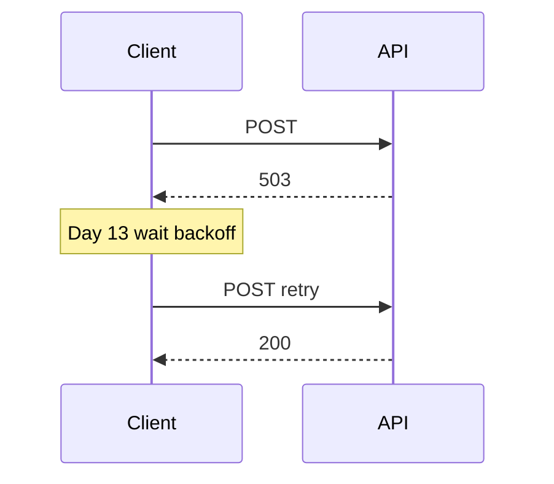

# Day 12 HTTP 与 REST 深度讲义

**篇幅**：约 3000 字

---

## 一、HTTP 协议回顾

HTTP（HyperText Transfer Protocol）是应用层协议，基于请求-响应模型。

### 1.1 报文结构

**请求**：

```
POST /v1/chat/completions HTTP/1.1
Host: api.deepseek.com
Content-Type: application/json
Authorization: Bearer sk-...
Content-Length: 123

{"model":"deepseek-chat",...}
```

**响应**：

```
HTTP/1.1 200 OK
Content-Type: application/json

{"id":"chatcmpl-...","choices":[...]}
```

### 1.2 常用方法

| 方法 | 语义 | NexusAgent 使用 |
|------|------|-----------------|
| GET | 获取资源 | http_demos |
| POST | 创建/提交 | Chat Completions |
| PUT/PATCH | 更新 | 未用 |
| DELETE | 删除 | 未用 |

Chat Completions 语义上是「创建一次 completion」，故用 POST。

---

## 二、状态码详解

| 码段 | 含义 | 示例 |
|------|------|------|
| 2xx | 成功 | 200 OK |
| 4xx | 客户端错误 | 401 鉴权、429 限流 |
| 5xx | 服务端错误 | 500 内部错误 |

本项目将 4xx/5xx 的 `HTTPError` 转为 `APIError`，保留 `status_code`。

---

## 三、REST 架构风格

REST（Representational State Transfer）不是协议，是设计风格：

1. **资源**：用 URL 标识，如 `/chat/completions`  
2. **表述**：JSON 作为资源表述  
3. **无状态**：每次请求自带完整鉴权与 body  
4. **统一接口**：标准 HTTP 方法  

OpenAI Chat API 是 RESTful 风格典型代表。

---

## 四、JSON 作为载荷

优点：

- 人类可读  
- 与 Python `dict` 天然映射  
- JavaScript 生态一致  

注意：

- 必须 `Content-Type: application/json`  
- UTF-8 编码  
- `json.dumps` 默认 ASCII escape 中文，可用 `ensure_ascii=False`（我们 body 用默认即可，中文在 UTF-8 中正常）

---

## 五、鉴权模式

### Bearer Token

```
Authorization: Bearer <token>
```

DeepSeek/OpenAI 采用此模式。Key 即密码，泄露等于账户被盗。

### 其他模式（了解）

- API Key 在 query（不推荐）  
- OAuth2（企业 SSO，Day 40+）  
- mTLS（双向证书，网关层）

---

## 六、超时与可靠性

`urllib.request.urlopen(..., timeout=60)`：

- 连接 + 读取共享超时（Python 3）  
- 防止无限挂起  

**今日无重试**。瞬时失败直接向上抛。Day 13 装饰器补充：



---

## 七、HTTPS 与 TLS

生产 API 均为 `https://`。urllib 默认验证服务器证书。

企业代理需配置信任链，否则 `SSL: CERTIFICATE_VERIFY_FAILED`。

---

## 八、与 GraphQL/gRPC 对比（拓展）

| 技术 | 特点 | LLM 行业 |
|------|------|----------|
| REST+JSON | 简单、通用 | ✅ 主流 |
| GraphQL | 灵活查询 | 少见 |
| gRPC | 高性能二进制 | 部分私有部署 |

NexusAgent 选择 REST OpenAI 兼容，降低集成成本。

---

## 九、实战 checklist

发起 Chat Completions 前确认：

- [ ] URL 正确（含 `/v1`）  
- [ ] method POST  
- [ ] headers：Content-Type + Authorization（非 Mock）  
- [ ] body 合法 JSON  
- [ ] timeout 已设  
- [ ] 错误路径转 APIError  

---

*urllib 对比：[13_深度扩展_urllib与requests.md](13_深度扩展_urllib与requests.md)*
