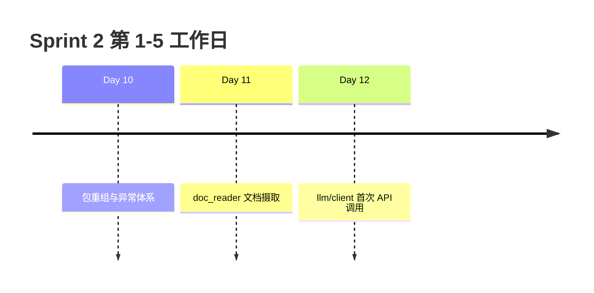

# Sprint 2 阶段回顾（Day 10 - Day 12）

**Sprint 2 主题**：工程化基础设施 — 包、文件、网络

---

## 三日脉络



---

## Day 10  recap

| 交付 | 要点 |
|------|------|
| 包结构重组 | `src/` 布局、`PYTHONPATH` |
| `core/exceptions` | NexusError 层次 |
| 模块导入 | 绝对导入、避免循环 |

**能力**：代码组织清晰，异常可追踪。

---

## Day 11 recap

| 交付 | 要点 |
|------|------|
| `tools/doc_reader.py` | 批量读 txt |
| 编码回退链 | utf-8 → gbk → ... |
| `StorageError` | 带 path 上下文 |
| `get_path` | sample_docs / doc_output |

**能力**：可靠把磁盘文档读入内存。

---

## Day 12 recap（今日）

| 交付 | 要点 |
|------|------|
| `llm/client.py` | LLMClient、urllib |
| `llm/env.py` | 环境变量、Mock |
| `llm/response.py` | parse_chat_completion |
| `APIError` | HTTP/API 错误 |

**能力**：首次出站 HTTP，OpenAI 兼容调用。

---

## 横向能力矩阵

| 能力 | D10 | D11 | D12 |
|------|-----|-----|-----|
| 标准库优先 | ✅ import | ✅ pathlib | ✅ urllib |
| 统一异常 | ✅ | ✅ StorageError | ✅ APIError |
| 路径注册 | ✅ get_path | ✅ 扩展 | ✅ chat_completion_sample |
| 可测试 | ✅ | ✅ pytest | ✅ Mock transport |
| 生产模块 | ✅ core/tools | ✅ doc_reader | ✅ llm |

---

## 数据流全景（Sprint 2 末）

```
磁盘 .txt ──doc_reader──► 清洗文本 ──(Day15+)──► Prompt
                                                    │
                                                    ▼
                                              LLMClient.complete
                                                    │
                                                    ▼
                                              assistant 回复
```

---

## 技术债与已知限制

| 项 | 状态 | 计划 |
|----|------|------|
| 无自动重试 | 已知 | Day 13 |
| 无流式输出 | 已知 | Day 16 |
| urllib 无连接池 | 接受 | Day 30+ httpx |
| 手写 .env 解析 | 接受 | 可选 dotenv |

---

## Sprint 2 剩余预览

| 日 | 主题 |
|----|------|
| Day 13 | 装饰器 + retry |
| Day 14 | cli_assistant |
| Day 15 | Prompt 与上下文 |

---

## 自我评估问卷

1. 能否不看代码画出 `LLMClient.complete` 流程？  
2. 能否解释 Mock 对 CI 的价值？  
3. 能否独立配置 `.env` 并切换 Mock/Live？  
4. `doc_reader` 与 `LLMClient` 在架构中各在哪一层？  

---

*Day 13 预习：装饰器语法与 functools.wraps*
