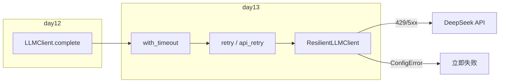

# Day 13 旁白解读：给 LLM 客户端穿上「防弹衣」

> **前置要求**：完成 Day 1-12，尤其 Day 12 `LLMClient.complete` 与 `APIError` / `ConfigError`

---

## 旁白

2026 年 7 月 18 日。智链科技理财知识库内测第二天，监控大屏突然一片橙红：

> 「DeepSeek 返回 503，用户提问卡死三十秒！」赵岩盯着 Grafana。

陈默在白板上画了两个同心圆：

```
内圈：with_timeout(60s)   — 单次调用不能无限等
外圈：retry(max_attempts=3) — 瞬时故障指数退避再试
```

林晓举手：「昨天 `LLMClient` 一抛错就全剧终。今天用**装饰器**包一层，不用改 `client.py` 核心逻辑？」

> 「正解。`ResilientLLMClient` 继承 `LLMClient`，只在 `complete()` 外包 `retry` + `with_timeout`。Day 12 的传输层、解析层**原封不动**。」

周航补充运维视角：

> 「429 限流、502 网关抖动——**值得重试**。401 Key 错了、400 参数错了——**立刻失败**，别浪费配额。`is_retryable_error` 把这条红线写死。」

下午，陈默用 `asyncio.gather` 演示三个模块并发预热，为 Day 16 流式输出埋伏笔：

> 「今天同步 `urllib` + 线程超时够用；未来高并发会切 `asyncio.wait_for`。先理解**装饰器组合**与**退避策略**。」

---

## 今日在架构中的位置



---

## 林晓的学习建议

1. 先跑 `decorator_demos.py`，理解无参装饰器与装饰器工厂  
2. 再跑 `retry_demos.py`，观察 429 两次失败后第三次成功  
3. 阅读 `retry.py` 的 `for attempt in range` 与 `time.sleep` 退避  
4. 最后 `NEXUS_LLM_MOCK=1 python3 src/day13/resilient_client_demo.py`  
5. **三遍原则**：读 `is_retryable_error` → 单步 `_build_resilient_complete` → 故意传错 Key 看不重试

---

## 与前后日的衔接

| 方向 | 内容 |
|------|------|
| 回顾 Day 12 | `LLMClient.complete` 为被装饰的「裸函数」 |
| 回顾 Day 10 | `ConfigError` / `APIError` 层次决定可否重试 |
| 今日核心 | `@retry` + `@with_timeout` + `RetryPolicy` |
| 预告 Day 14 | `cli_assistant` 多轮 `chat()`，历史 messages 累积 |
| 预告 Day 16 | 流式 SSE，异步超时替代线程池 |

---

*下一篇：[01_企业背景与今日任务.md](01_企业背景与今日任务.md)*
