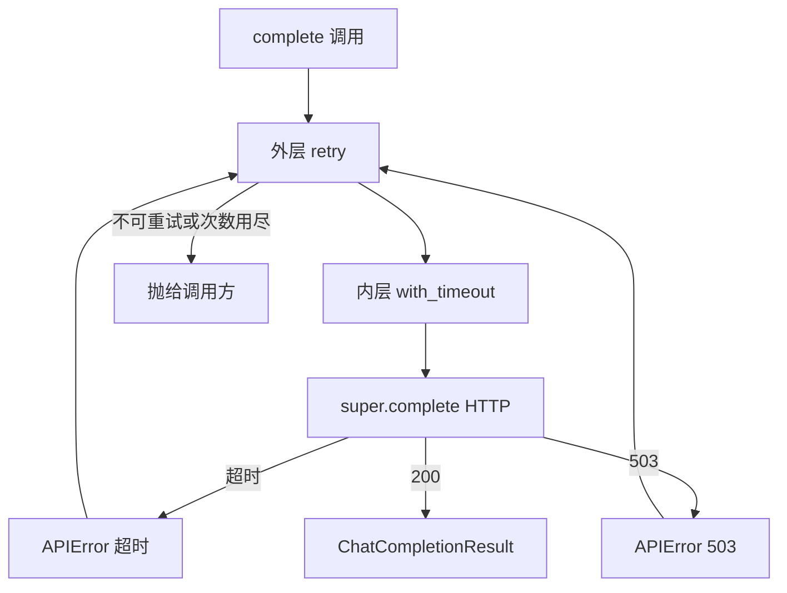

# ZL-NA-REQ-013 扩展说明

**关联主文档**：[02_需求文档.md](02_需求文档.md)

---

## 1. 非功能需求

### 1.1 性能

| 指标 | 要求 |
|------|------|
| 单次成功调用开销 | 装饰器层 < 1ms（不含 sleep） |
| 默认最坏延迟 | 3 次尝试 + 1s + 2s sleep ≈ 基础调用 + 3s（可配置） |
| 线程池 | `with_timeout` 每次调用新建 `max_workers=1` 池（MVP 可接受） |

### 1.2 可观测性

- `ResilientLLMClient(on_retry_log=True)` 打印：`⏳ 重试 1/2: ... HTTP 503，1.0s 后重试`  
- 生产环境建议将 `on_retry` 接入结构化日志（Day 25 运维专题）

### 1.3 安全

- **禁止**对 `ConfigError`（缺 Key）重试——避免日志刷屏与误导运维  
- **禁止**对 401 重试——Key 无效时重试无意义且可能触发风控

---

## 2. 指数退避公式

第 `k` 次失败后的等待（`k` 从 1 计）：

```
sleep_k = min(base_delay × backoff_factor^(k-1), max_delay)
```

默认策略下：

| 失败次序 | 等待（秒） |
|----------|------------|
| 第 1 次失败后 | min(1.0, 30) = 1.0 |
| 第 2 次失败后 | min(2.0, 30) = 2.0 |
| 第 3 次失败 | 不再重试，抛异常 |

演示脚本 `retry_demos.py` 使用 `base_delay=0.05` 加速课堂演示。

---

## 3. 装饰器组合语义



**关键**：每次重试都会**重新执行**内层超时包装，计时器归零。

---

## 4. 与业界实践对照

| 能力 | NexusAgent Day 13 | AWS SDK | Google API Client |
|------|-------------------|---------|-------------------|
| 指数退避 | ✅ | ✅ | ✅ |
| 可重试状态码白名单 | ✅ 429/5xx | ✅ | ✅ |
| 抖动（jitter） | ❌ 未实现 | ✅ 可选 | ✅ |
| 断路器 | ❌ | 部分服务 | ✅ |

**扩展建议**（选修）：在 `sleep_for` 上加 `random.uniform(0, sleep_for * 0.1)` 防止惊群。

---

## 5. 测试用例清单

| 用例 | 预期 |
|------|------|
| 首次成功 | 调用 1 次，无 sleep |
| 429 ×2 后成功 | 调用 3 次，sleep 2 次 |
| 401 一次 | 调用 1 次，立即失败 |
| ConfigError | 调用 1 次，不重试 |
| 超时 | `APIError` 超时文案，可重试则进入退避 |
| `max_attempts=1` | 等价无重试 |
| `functools.wraps` | `wrapper.__name__` 与被装饰函数一致 |

---

## 6. Day 14 衔接

`cli_assistant` 将：

1. 实例化 `ResilientLLMClient.from_env()`  
2. 循环读取用户输入，追加 `ChatMessage("user", ...)`  
3. 调用 `complete(messages)`，打印 assistant 回复并追加历史  
4. 用户感知：网络抖动时自动重试，无需手动「再试一次」

---

*返回：[02_需求文档.md](02_需求文档.md)*
