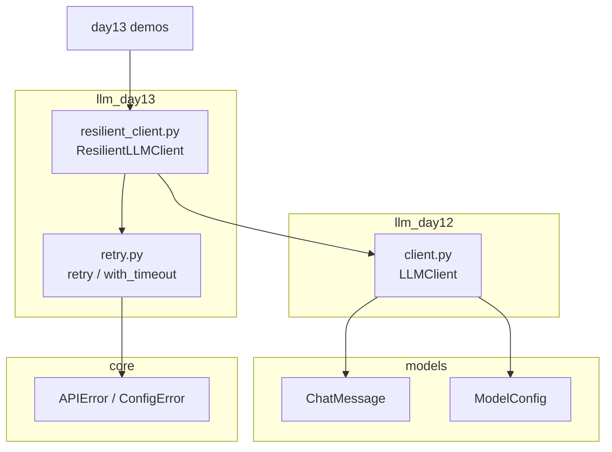
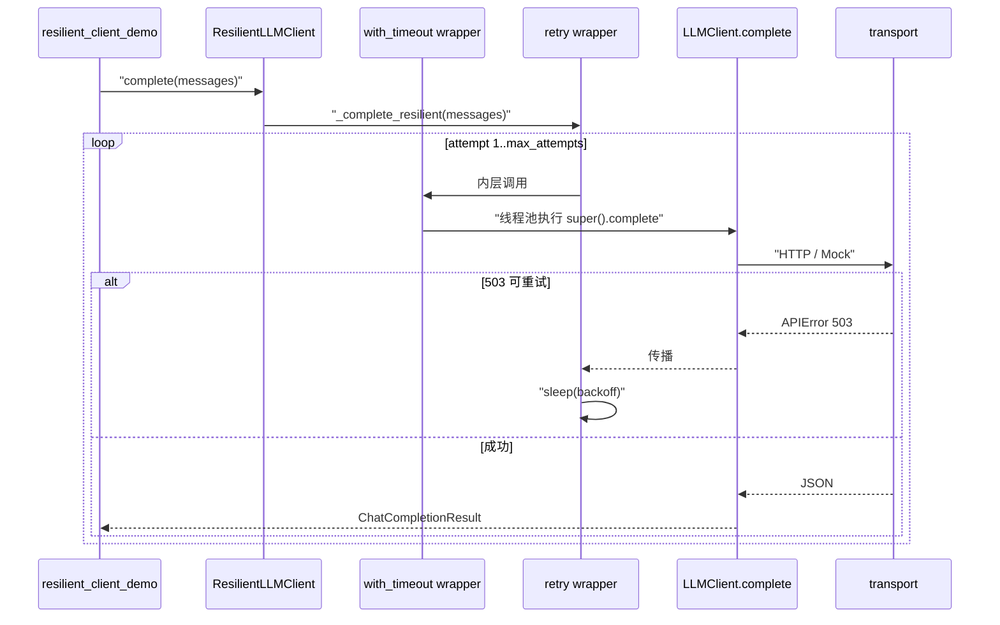

# Day 13 架构设计

## 模块图



## 分层职责

| 层 | 模块 | 职责 |
|----|------|------|
| 装饰器层 | `llm/retry` | 通用重试、超时、策略配置 |
| 客户端扩展层 | `llm/resilient_client` | 将策略应用于 `complete` |
| 传输层（不变） | `llm/client` | urllib、Mock transport |
| 异常层 | `core/exceptions` | 可重试判定依据 |

## ResilientLLMClient 调用序列



## 构造决策树

```
需要重试/超时？
  ├─ 否 → 直接用 LLMClient（Day 12）
  └─ 是 → ResilientLLMClient
        ├─ policy 默认 RetryPolicy()
        ├─ on_retry_log=True → 打印重试行
        └─ transport 可注入（测试 flaky API）
```

## `_build_resilient_complete` 设计

在 `__init__` 中**闭包捕获** `self.policy`，生成 `_complete_resilient`：

```python
@retry(...)
@with_timeout(self.policy.timeout_seconds)
def _call(messages):
    return super(ResilientLLMClient, self).complete(messages)
```

要点：

1. 装饰器在实例化时应用一次，非每次 `complete` 重新装饰  
2. `super(ResilientLLMClient, self)` 显式绑定，避免闭包中 `self` 歧义  
3. 外层 `complete()` 仅转发到 `_complete_resilient`

## 数据流（与 Day 12 对比）

| 阶段 | Day 12 | Day 13 |
|------|--------|--------|
| 输入 | `list[ChatMessage]` | 同左 |
| 边界 | `build_request_body` | 同左（未改） |
| 传输 | `transport(...)` | 同左，外包超时 |
| 失败 | 立即抛错 | 可重试则 sleep 后再传 |
| 输出 | `ChatCompletionResult` | 同左 |

## 包结构

```
src/
├── llm/
│   ├── client.py          # Day 12，不变
│   ├── retry.py           # Day 13 新增
│   └── resilient_client.py
└── day13/
    ├── decorator_demos.py
    ├── retry_demos.py
    ├── async_demos.py
    └── resilient_client_demo.py
```

## 设计原则

1. **装饰器优于继承深链**：容错横切关注点与业务分离  
2. **失败快速**：不可重试异常零 sleep  
3. **可测试**：注入 `transport` 模拟 503 序列  
4. **元数据保留**：`functools.wraps` 服务调试与 mock patch

---

*流程图：[04_流程图与示意图.md](04_流程图与示意图.md)*
