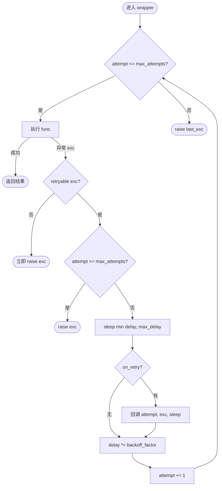
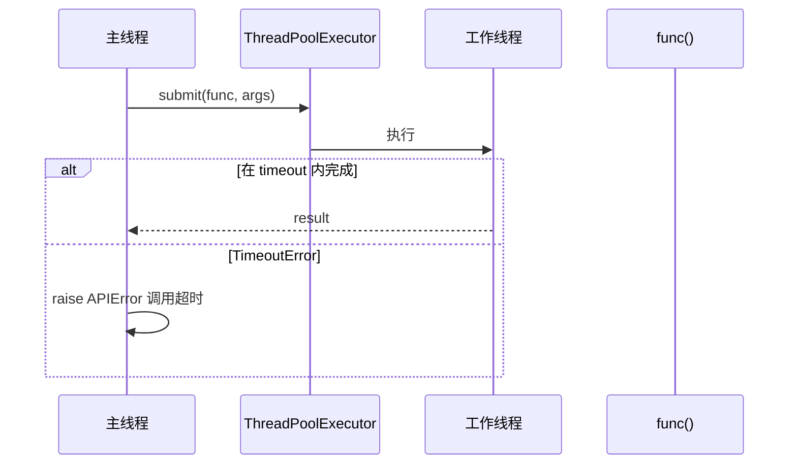
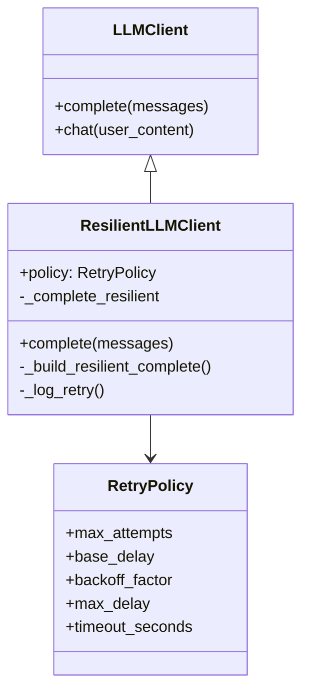
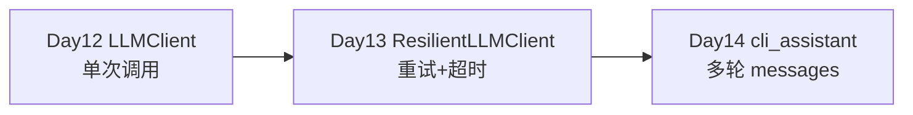

# Day 13 流程图与示意图

## 1. retry 装饰器执行流程



## 2. is_retryable_error 判定树

```
exc 类型？
├─ ConfigError / ModelValidationError → False
├─ APIError
│   ├─ status_code is None → True（网络层）
│   ├─ code in {429,500,502,503,504} → True
│   └─ 其他（含 401, 403, 404）→ False
└─ 其他 BaseException → False
```

## 3. with_timeout 线程模型



**注意**：`urllib` 阻塞在工作线程；主线程 `future.result(timeout)` 超时后，工作线程可能仍在运行直到 HTTP 完成（MVP 限制，Day 16 异步改进）。

## 4. 指数退避时间线（默认策略）

```
t=0     第1次调用 ──失败(503)──►
t=1s    sleep 1.0
t=1s    第2次调用 ──失败(503)──►
t=3s    sleep 2.0
t=3s    第3次调用 ──成功──► 返回
```



```mermaid
gantt
    title 默认 RetryPolicy 三次尝试时间线
    dateFormat X
    axisFormat %S秒

    section 调用
    尝试1           :0, 1
    等待1s          :1, 1
    尝试2           :2, 1
    等待2s          :3, 2
    尝试3成功       :5, 1
```

## 5. ResilientLLMClient 类关系



## 6. Day 12 → Day 13 → Day 14 演进



## 7. 演示脚本依赖

| 脚本 | 演示点 |
|------|--------|
| `decorator_demos.py` | `@log_call`、`@repeat(3)`、`wraps` |
| `retry_demos.py` | 429 两次失败后成功 |
| `async_demos.py` | `asyncio.gather` 并发 |
| `resilient_client_demo.py` | 503 flaky transport + Mock |

---

*课堂笔记：[05_课堂笔记_上午.md](05_课堂笔记_上午.md)*
