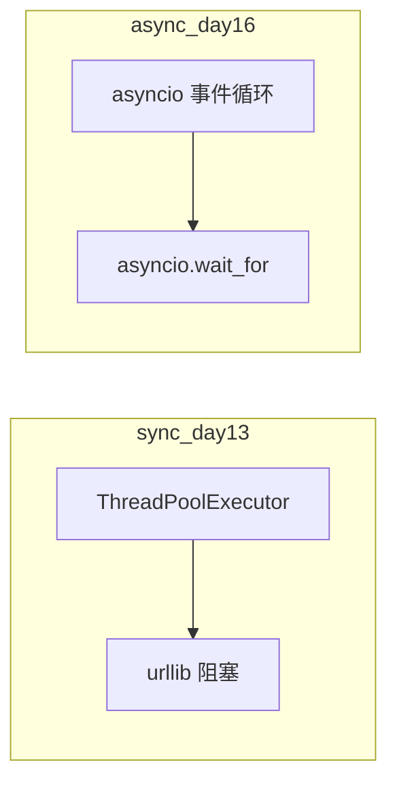

# Day 13 深度扩展：异步编程预习

**篇幅**：扩展阅读 · 约 3200 字  
**代码锚点**：`nexus-agent-platform/src/day13/async_demos.py`

---

## 一、为何 Day 13 引入 asyncio

Day 12–13 使用**同步 urllib** + **线程超时**，足以支撑 MVP 单次 `complete`。

Sprint 2 末与 Sprint 3 将面对：

- **多工具并发**（读文档 + 调 LLM + 写缓存）  
- **Day 16 流式 SSE**（长时间可读事件）  
- **Day 14 CLI** 在等待 LLM 时保持响应（进阶）

陈默策略：**今日浅尝 `asyncio.gather`，建立「协程 vs 线程」直觉**，不深挖 `async/await` 语法全家桶。

---

## 二、async_demos 走读

```python
async def fetch_label(name: str, delay: float) -> str:
    await asyncio.sleep(delay)
    return f"{name} OK"

async def main_async() -> None:
    results = await asyncio.gather(
        fetch_label("doc_reader", 0.1),
        fetch_label("llm_client", 0.1),
        fetch_label("retry", 0.1),
    )
```

### 2.1 关键字

| 关键字 | 含义 |
|--------|------|
| `async def` | 定义协程函数，调用返回 coroutine 对象 |
| `await` | 挂起当前协程，让出事件循环 |
| `asyncio.gather` | 并发多个 awaitable，汇总结果 |
| `asyncio.run` | 同步入口，创建并关闭 event loop |

### 2.2 与 time.sleep 对比

| | `time.sleep(0.1)` | `await asyncio.sleep(0.1)` |
|--|-------------------|----------------------------|
| 阻塞 | 阻塞整个线程 | 仅挂起当前协程 |
| 并发 | 需多线程 | 单线程事件循环 |

**严禁**在协程内 `time.sleep`——阻塞事件循环，并发退化为串行。

---

## 三、同步重试 vs 异步重试（展望）

### 3.1 今日同步模型

```python
time.sleep(sleep_for)  # retry 内阻塞线程
```

简单、与 urllib 兼容；高并发时线程栈内存可观。

### 3.2 Day 16 方向

```python
async def async_retry(...):
    for attempt in range(...):
        try:
            return await func(...)
        except ...:
            await asyncio.sleep(sleep_for)
```

配合 `httpx.AsyncClient` 或 `aiohttp`，单线程成千上万挂起连接。

---

## 四、超时模型对比



| 机制 | Day 13 | Day 16（计划） |
|------|--------|----------------|
| 超时 API | `future.result(timeout)` | `asyncio.wait_for(coro, timeout)` |
| 取消 | 难 | 协程可取消传播 |
| 适用 | 同步客户端 | 流式 SSE |

---

## 五、asyncio.gather 语义

```python
results = await asyncio.gather(a(), b(), c())
```

- 默认 **并发** 启动三个协程  
- 若任一抛异常，默认 **全部取消** 并抛第一个异常（`return_exceptions=True` 可改）  
- 返回列表顺序与参数顺序一致

映射 NexusAgent：`doc_reader`、`llm_client`、`retry` 模块「并行就绪」隐喻。

---

## 六、何时不必上异步

陈默红线：

1. 团队未掌握 async 调试  
2. 库链不支持（全同步 urllib）  
3. QPS 低、逻辑以重试 sleep 为主

**先正确同步，再按需异步**——与课程「标准库 urllib 先行」一致。

---

## 七、动手扩展（选修）

在 `async_demos.py` 增加：

```python
async def flaky_async(attempts: dict):
    attempts["n"] += 1
    if attempts["n"] < 3:
        raise APIError("503", status_code=503)
    return "ok"
```

思考：异步重试应 `await asyncio.sleep` 还是 `time.sleep`？

---

## 八、术语卡

| 术语 | 解释 |
|------|------|
| 协程 | 可暂停恢复的函数 |
| 事件循环 | 调度协程的运行时 |
| awaitable | 可被 await 的对象 |
| 阻塞 | 占着线程不放 |

---

*企业案例：[14_企业案例集_容错设计.md](14_企业案例集_容错设计.md)*
